# 1.线程的概述
## 1.1线程的相关概念
- 进程(process)
> 1. 进程是计算机中的程序关于某个数据集合的一次运行活动,是操作系统进行资源分配与调度的基本单位.
> 2. 可以把进程简单的理解为正在操作系统上运行的一个程序
- 线程(thread)
> 1. 线程是进程的一个执行单元
> 2. 一个线程就是进程中一个单一顺序的控制流,进程的一个执行分支
> 3. 进程就是线程的容器,一个进程至少有一个线程,一个进程也可以有多个线程
> 4. 操作系统中,是按照进程为基本单位分配资源,每一个线程都有各自的线程栈,寄存器环境,线程的本地存储
> 5. 在java中线程作为最小的调度单位,进程作为资源分配的最小单位,在windows中进程是不活动的,只是作为线程的容器
- 主线程和子线程
> 1. JVM启动时会创建一个主线程,该线程负责执行main方法
> 2. java中的线程不是孤立存在的,线程之间存在一些联系.如果A线程创建的B线程,就称B线程是A线程的子线程,相应的A是B的父线程
- 串行并行和并发
> 有三个任务:
> - 任务A准备5分钟,等待10分钟
> - 任务B准备2分钟,等待8分钟
> - 任务C准备10分钟
>
> 时间:
> - 串行(Sequential): 所有任务逐个执行; 耗时: 15+10+10=35分钟
> - 并发(Concurrent): 等待时间可以开始下一个任务; 耗时:  5+2+10=17(C任务10分钟大于B任务8分钟,且B等待2分钟+C任务10分钟大于A任务等待10分钟)
> - 并行(Parallel): 3个任务同时开始,耗时取决于任务耗时最长的任务; 耗时: 15分钟
>
> 并发可以提高事务的处理效率,即一段时间可以处理完成更多的事务
> 并行是一种理想的并发,从硬件角度,单核CPU,操作系统使用时间片轮转技术,让用户感觉是并行执行的
>
# 2.应用
## 2.1案例一:异步调用
从方法的角度来讲,如果
- 需要等待结果的返回,才能继续运行就是同步
- 不需要等待结果的返回,就能继续运行就是同步
注意:同步在多线程还有另一层的意思,是让多个线程步调一致
### 1)设计-pro1.src.main.java.p2
多线程可以让方法执行变为异步的(即不要巴巴干等着）比如说读取磁盘文件时，假设读取操作花费了5秒钟，如果没有线程调度机制，这5秒调用者什么都做不了，其代码都得暂停..
### 2)结论
- 比如在项目中，视频的格式需要转换格式等操作比较费时，这时开一个新线程处理视频转换，避免阻塞主线程
- tomcat的异步servlet也是类似的目的，让用户线程处理耗时比较长的操作，避免阻塞tomcat的工作线程
- ui程序中，开线程进行其他操作，避免阻塞ui线程
## 2.2应用之提升效率
### 1)设计
[Link-效率1](pdf/并发编程_应用.pdf)
### 2)结论
1. 在单核cpu下，多线程不能实际提高程序的运行效率，只是为了能够在不同的任务之间切换，多个线程轮流使用cpu，不至于一个线程总占用cpu，别的线程没法干活
2. 多核cpu可以并行跑多个线程，但能否提高程序的运行效率还是要分情况的
    - 有些任务，经过精心设计，将任务拆分，并行执行，当然可以提高程序的运行效率。但不是所有的计算任务都可以拆分
    - 也不是所有的任务需要拆分，任务的目的如果不同，谈拆分和效率没什么意义
- IO操作不占用cpu，只要我们一般拷贝文件使用的是[阻塞IO]，这时相当于线程虽然不用cpu，但需要一直等待IO结束，没有充分利用线程。所以有了后面的[非阻塞IO]和[异步IO]优化

# 3.Java线程
## 3.1创建和运行线程

---
### 1)直接使用Thread
```java

@Slf4j
public class Test0 {
    public static void main(String[] args) {
        //创建线程并重写run方法
        Thread thread = new Thread() {
            @Override
            public void run() {
                log.debug("running");
            }
        };
        //给线程命名
        thread.setName("t1");
        //运行线程
        thread.start();
        log.debug("running");
    }
}
```
### 2)使用Runnable配合Thread
把**线程**和**任务**(要执行的代码)分开
- Thread 代表线程
- Runnable 可运行的任务(线程要执行的代码)
```java
@Slf4j
public class Test1 {
    public static void main(String[] args) {
        //1.创建任务对像(匿名内部类创建Runnable实现)
        Runnable runnable = new Runnable() {
            @Override
            public void run() {
                log.debug("hello");
            }
        };
        //2.创建线程对象
        Thread thread = new Thread(runnable);
        //3.运行
        thread.start();
        log.debug("hello");
    }
}
```
Java8以后使用Lambda精简代码
```java
@Slf4j
public class Test2 {
   public static void main(String[] args) {
      //创建任务对象(Lambda方式创建)
      Runnable runnable = ()-> log.debug("hello");
      //2.创建线程对象
      Thread thread = new Thread(runnable);
      //运行
      thread.start();
      log.debug("hello");
   }
}
```

### 3)FutureTask配合Thread
实现
```java
@Slf4j
public class Test3 {
    public static void main(String[] args) {
        //1.创建任务对象，使用Lambda
        FutureTask<Integer> task0 = new FutureTask<>(() -> {
            log.debug("hello");
            return 100;
        });
        //2.创建线程对象，参数1：任务对象；参数2：线程名称，推荐
        Thread thread = new Thread(task0, "task0");
        //3.启动线程
        thread.start();
        //4.获取任务对象的返回值
        Integer result = null;
        try {
            result = task0.get();
        }catch (Exception e) {
            throw new RuntimeException(e);
        }
        log.debug("结果是：{}", result);
    }
}
```
线程通信（了解）
```java
@Slf4j
public class Test4 {
    public static void main(String[] args) throws Exception {
        FutureTask<Integer> task0 = new FutureTask<>(new Callable<Integer>() {
            @Override
            public Integer call() throws Exception {
                log.debug("running...");
                Thread.sleep(1000);
                return 100;
            }
        });
        Thread thread = new Thread(task0, "task0");
        thread.start();
        //主线程获取子线程的返回值，也就是阻塞
        log.debug("result {}", task0.get());
    }
}
```

### 4)Thread与Runnable的关系
- 方法1是把线程和任务放在一起的，Thread调用的是自己重写后的run()方法
- 方法2是把线程和任务分开的，Thread调用的是父类中的run()方法，进一步调用Runnable接口实现类实现的run()方法
- 建议使用方法2，
  - 用Runnable更容易与线程池等高级API配合
  - 用Runnable让任务脱离了Thread的继承体系，更灵活

## 3.2观察多个线程同时运行

---
>主要是理解
> - 交替执行
> - 谁先谁后，不由我们控制
> 
```java
@Slf4j
public class Test5 {
    public static void main(String[] args) {
        //线程0
        new Thread(() -> {
            while (true) {
                log.debug("running");
            }
        }, "t0").start();

        //线程1
        new Thread(() -> {
            while (true) {
                log.debug("running");
            }
        }, "t1").start();
    }
}
```
## 3.3查看进程的方法
### Windows
- 任务管理器可以查看进程和线程，也可以用来杀死进程
- tasklisk查看进程
- taskkill杀死进程


### Linux
- ps -fe 查看所有进程
- ps -fT -p <PID> 查看某个进程（PID）的所有线程
- kill <PID> 杀死线程
- top 按大写H切换是否显示线程
- top -H -p <PID> 查看某个进程（PID）的所有线程

### Java
- jps命令查看所有Java进程
- jstack <PID> 查看某个Java(PID)的所有线程状态
- jconsole 来查看某个Java进行中的线程运行情况（图形界面）

jconsole远程监控配置
- 打开jconsole
  - <kbd>windows</kbd> + <kbd>R</kbd>
  - 输入 jconsole <kbd>Enter</kbd>
- 需要依如下方式运行Java类
> java -Djava.rmi.server.hostname=[ip地址] -Dcom.sun.management.jmxremote -Dcom.sun.management.jmxremote.port=[连接端口] -Dcom.sun.management.jmxremote.ssl=是否安全连接 -Dcom.sun.management.jmxremote.authenticate=是否认证Java类
> 
- 修改/etc/hosts文件将127.0.0.1映射至主机名

如果要认证访问，还需要做如下步骤
- 复制jmxremote.password文件
- 修改jmxremote.password和jmxremote文件的权限为600即文件所有者可读写
- 连接时填入controlRole（用户名），R&D（密码）

## 3.4原理之线程运行
### 栈与栈帧
Java Virtual Machine Stacks (Java虚拟机栈)
> 我们都知道JVM中由堆、栈、方法区所组成，其中栈内存是给谁用的呢?其实就是线程，每个线程启动后，虚拟机就会为其分配一块栈内存。
> 
- 每个栈由多个栈帧(Frame）组成，对应着每次方法调用时所占用的内存
- 每个线程只能有一个活动栈帧，对应着当前正在执行的那个方法

### 线程上下文切换(Thread Context Switch)
> 因为以下一些原因导致cpu不在执行当前线程，转而执行另一个线程的代码

- 线程的cpu时间片用完了
- 垃圾回收
- 有更高优先级的线程需要
- 线程自己调用了sleep、yield、wait、join、park、synchronized、lock等方法程序
> 当Context Switch 发生时，需要由操作系统保存当前线程的状态，并恢复另一个线程的状态，Java中对应的概念就是程序计数器(Program Counter Register)，它的作用是记住下一条jvm指令的执行地址，是线程私有的
> Context Switch频繁发生会影响性能

## 3.5常见方法


| 方法名          | 功能说明                                                     | 注意                                                         |
| :-------------- | :----------------------------------------------------------- | :----------------------------------------------------------- |
| start()         | 启动一个新线程，在新线程运行run() 方法中的代码               | start方法只是让线程进入就绪，里面代码不一定立刻运行(CPU的时间片还没分给它)。每个线程对象的start方法只能调用一次，如果调用了多次会出现IllegalThreadStateException |
| run()           | 新线程启动会调用的方法                                       | 如果在构造Thread对象时传递了Runnable参数，则线程启动后会调用Runnable 中的run方法，否则默认不执行任何操作。但可以创建Thread的子类对象，来覆盖默认行为 |
| join()          | 等待线程运行结束                                             |                                                              |
| join(long n)    | 等待线程与运行结束，最多等待n毫秒                            |                                                              |
| getId()         | 获取线程长整型的id                                           | id唯一                                                       |
| getName()       | 获取线程名                                                   |                                                              |
| setName()       | 设置线程名                                                   |                                                              |
| getPriority()   | 获取线程优先级                                               |                                                              |
| setPriority()   | 修改线程优先级                                               | java中规定线程优先级是1~10的整数，较大的优先级能提高该线程被CPU调度的机率 |
| getState()      | 获取线程状态                                                 | Java 中线程状态是用6个enum表示，分别为：NEW,RUNNABLE,BLOCKED,WAITING,TIMED_WAITING,TERMINATED |
| isInterrupted() | 判断是否被打断                                               | 不会清除`打断标记`                                           |
| isAlive()       | 线程是否存活(还没有运行完毕)                                 |                                                              |
| interrupt()     | 打断线程                                                     | 如果被打断线程正在sleep,wait，join 会导致被打断的线程抛出InterruptedException，并清除`打断标记`;如果打断的正在运行的线程，则会设置`打断标记`; park的线程被打断，也会设置`打断标记` |
| interrupted()   | static 判断是否被打断                                        | 不会清除`打断标记`                                           |
| currentThread() | static 获取当前正在执行的线程                                |                                                              |
| sleep(long n)   | static 让当前执行的线程休眠n毫秒，休眠时让出cpu的时间片给其它线程 |                                                              |
| yield()         | static 提示线程调度器让出当前线程对CPU的使用                 | 主要为了测试和调试                                           |

## 3.6start 与 run
### 3.6.1调用run()
```java
@Slf4j
public class Test8Run {
    public static void main(String[] args) {
        Thread thread = new Thread("t1") {
            @Override
            public void run() {
                log.debug("当前线程为: {}", Thread.currentThread().getName());
            }
        };
        thread.run();
        log.debug("主线程结束");
    }
}
```
 输出 
 ```text
17:16:11.098 [main] DEBUG p3.t4.Test8Run - 当前线程为: main
17:16:11.104 [main] DEBUG p3.t4.Test8Run - 主线程结束
```
结论
> 程序仍在main线程运行，同步的
> 
## 3.7sleep与yield
### sleep
1. 调用sleep 余让当前线程从 *Running* 进入 *TimedWaiting* 状态（阻塞）
2. 其它线程可以使用interrupt方法打断正在睡眠的线程，这时sleep方法会抛出InterruptedException 
3. .睡眠结束后的线程未必会立刻得到执行
4. 建议用TimeUnit的sleep代替Thread的sleep来获得更好的可读性
### yield
1. 调用yield会让当前线程从Running进入Runnable就绪状态，然后调度执行其他线程
2. 具体的实现依赖于操作系统的任务调度器
### 线程优先级
- 线程优先级会提示（hint）调度器优先执行该线程，但他仅仅是一个提示，调度器可以忽略他
- 如果cpu比较忙，那么优先级高的的线程会获得更多的时间片，但cpu闲时，优先级几乎没有作用
```java
@Slf4j
public class Test12Yield {
    public static void main(String[] args) {
        Runnable task1 = () -> {
            int count = 0;
            while (true) {
                System.out.println("----->1 " + count++);
            }
        };
        Runnable task2 = () -> {
            int count = 0;
            while (true) {
//                Thread.yield();
                System.out.println("\t----->2 " + count++);
            }
        };
        Thread t1 = new Thread(task1, "t1");
        Thread t2 = new Thread(task2, "t2");
        t1.setPriority(Thread.MIN_PRIORITY);
        t2.setPriority(Thread.MAX_PRIORITY);
        t1.start();
        t2.start();
    }
}
```

## 3.8join方法详解
### 为什么需要join
下面的代码执行，r打印多少？
```java
@Slf4j
public class Test13Join {
    static int r = 0;
    public static void main(String[] args) {
        test1();
    }
    public static void test1() {
        log.debug("开始");
        Thread t1 = new Thread("t1") {
            @Override
            public void run() {
                log.debug("开始");
                try {
                    sleep(1);
                } catch (InterruptedException e) {
                    throw new RuntimeException(e);
                }
                log.debug("结束");
                r = 10;
            }
        };
        t1.start();
        log.debug("结果为: {}", r);
        log.debug("结束");
    }
}
```
分析
- 因为主线程和线程t1是并行执行的，t1线程需要1s才能赋值r=10
- 而主线程一开始就要打印r的结果，所以只能打印出r=0

解决方法
- 用sleep行不行？为什么？ 
> 可以，但是我们不知道要等待多长时间，这就很难把控，join()方法就可以解决)
- 用join，加在t1.start()之后即可

### 等待多个结果
```java
@Slf4j
public class Test14Join {
    static int r1 = 0;
    static int r2 = 0;
    public static void main(String[] args) throws InterruptedException {
        test2();
    }
    public static void test2() throws InterruptedException {
        Thread t1 = new Thread("t1") {
            @Override
            public void run() {
                try {
                    sleep(1000);
                    r1 = 10;
                } catch (InterruptedException e) {
                    throw new RuntimeException(e);
                }
            }
        };
        Thread t2 = new Thread("t2") {
            @Override
            public void run() {
                try {
                    sleep(2000);
                    r2 = 20;
                } catch (InterruptedException e) {
                    throw new RuntimeException(e);
                }
            }
        };
        t1.start();
        t2.start();
        long start = System.currentTimeMillis();
        log.debug("join begin");
        t1.join();
        log.debug("t1 join end");
        t2.join();
        log.debug("t2 join end");
        long end = System.currentTimeMillis();
        log.debug("r1: {}, r2: {}, cost: {}", r1, r2, (end-start));
    }
}
```
### 有时效的join
```java
@Slf4j
public class Test15Join {
    static int r1 = 0;
    public static void main(String[] args) throws InterruptedException {
        test2();
    }
    public static void test2() throws InterruptedException {
        Thread t1 = new Thread("t1") {
            @Override
            public void run() {
                try {
                    sleep(2000);
                    r1 = 10;
                } catch (InterruptedException e) {
                    throw new RuntimeException(e);
                }
            }
        };

        t1.start();
        long start = System.currentTimeMillis();
        log.debug("join begin");
        t1.join(1500);//主线程只会等待t1线程1.5s，如果1.5s后t1线程没有结束，主线程将不会等待
        long end = System.currentTimeMillis();
        log.debug("r1: {}, cost: {}", r1,  (end-start));
    }
}
```
## 3.9interrupt方法详解
### 打断（阻塞）sleep，wait，join的线程
打断sleep的线程，会清空打断状态，以sleep为例
```java
@Slf4j
public class Test16Interrupt {
    public static void main(String[] args) throws InterruptedException {
        Thread t1 = new Thread( () -> {
            log.debug("sleep...");
            try {
                //sleep、wait、join被打断后会将 打断标记 清空
                sleep(5000);
            } catch (InterruptedException e) {
                throw new RuntimeException(e);
            }
        }, "t1");
        t1.start();
        Thread.sleep(1000);
        log.debug("interrupt...");
        t1.interrupt();
        log.debug("打断状态: {}", t1.isInterrupted());
    }
}
```
### 打断正常运行的线程
打断正常运行的线程，不会清空打断状态
```java
@Slf4j
public class Test17Interrupt {
    public static void main(String[] args) throws InterruptedException {
        Thread t1 = new Thread(() -> {
            while (true) {
                boolean interrupted = Thread.currentThread().isInterrupted();
                if (interrupted) {
                    log.debug("被打断了");
                    break;
                }
            }
        }, "t1");
        Thread.sleep(1000);
        log.debug("interrupt");
        t1.interrupt();
    }
}
```
## <font face="宋体" color="#FF0000">模式之两阶段终止</font>
### 两阶段终止模式
Two Phase Termination
> 在一个线程T1中如何**优雅**的终止T2线程？这里的**优雅**指的是给T2一个料理后事的机会
> 

### 1.错误思路
- 使用线程对象的stop()方法停止线程
  - stop()方法会真正的杀死线程，如果这时线程锁住了共享资源，那么它被杀死后再也没有机会释放锁了，其他线程将永远无法获取锁
- 使用System.exit(int) 方法停止线程
  - 目的仅仅是停止一个线程，但这种做法会让整个程序停止
### 2.两阶段终止模式
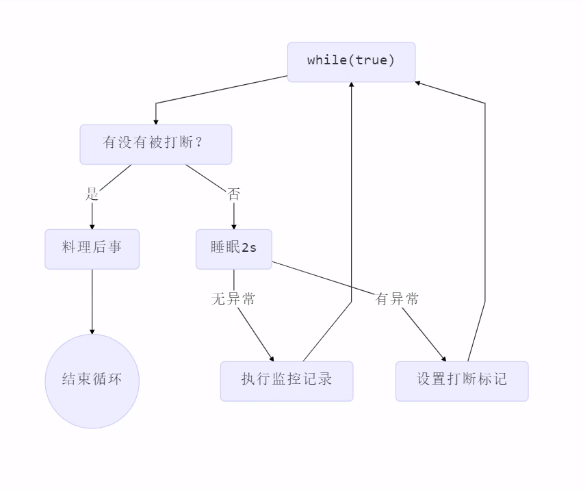
```java
@Slf4j
public class Test18Interrupt {
    public static void main(String[] args) throws InterruptedException {
        TowPhaseTermination tpt = new TowPhaseTermination();
        tpt.start();
        TimeUnit.SECONDS.sleep(4);
        tpt.stop();
    }
}
@Slf4j
class TowPhaseTermination {
    private Thread monitor;

    //启动监控线程
    public void start() {
        monitor = new Thread(() -> {
            while (true) {
                //获取当前线程
                Thread current = Thread.currentThread();
                //判断是否被打断
                if (current.isInterrupted()) {
                    log.debug("料理后事");
                    break;
                }
                try {
                    TimeUnit.SECONDS.sleep(1);//情况1
                    log.debug("执行监控记录");//情况2
                } catch (InterruptedException e) {
                    e.printStackTrace();
                    //重新设置打断标记
                    current.interrupt();
                }
            }
        });
        monitor.start();
    }
    //停止监控线程
    public void stop() {
        monitor.interrupt();
    }
}
```
### 打断park线程
打断park线程，不会清空打断状态

## 3.10不推荐的方法
还有一些不推荐的方法，这些方法已经过时，容易破坏同步代码块，造成死锁


## 3.11主线程和守护线程
默认情况下，Java进程需要等待所有的线程都运行结束，才会结束。有一种特殊的线程叫守护线程，只要其他非守护线程运行结束了，即使守护线程的代码没有执行完，也会强制结束
例如：

非守护线程
```java
@Slf4j
public class Test20 {
    public static void main(String[] args) throws InterruptedException {
        Thread t1 = new Thread( () -> {
            while (true) {
                if (Thread.currentThread().isInterrupted()) {
                    break;
                }
            }
            log.debug("结束");
        }, "t1");
        t1.start();
        TimeUnit.SECONDS.sleep(1);
        log.debug("结束");
    }
}
```
守护线程
```java
@Slf4j
public class Test20 {
    public static void main(String[] args) throws InterruptedException {
        Thread t1 = new Thread( () -> {
            while (true) {
                if (Thread.currentThread().isInterrupted()) {
                    break;
                }
            }
            log.debug("结束");
        }, "t1");
        //设置为守护线程
        t1.setDaemon(true);
        t1.start();
        TimeUnit.SECONDS.sleep(1);
        log.debug("结束");
    }
}
```
> **注意**
> - 垃圾回收器线程就是一种守护线程
> - Tomcat中的Acceptor和Poller线程都是守护线程，所以Tomcat收到shutdown命令后，不管等待它们处理完当前请求
> 
## 3.12线程的五种状态
从**操作系统层**面来叙述
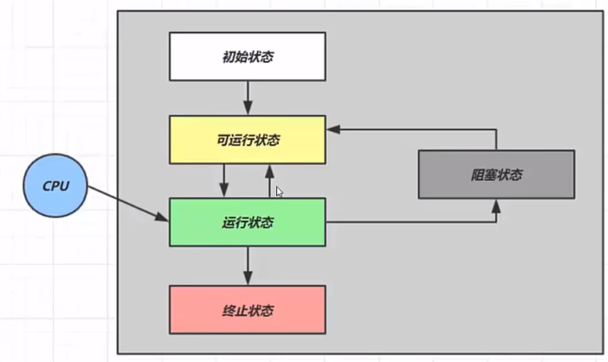
- 【初始状态】仅是在语言的层面创建了线程对象，还未与操作系统关联
- 【可运行状态】（就绪状态）指该线程已经被创建（与操作系统线程关联），可以由CPU自由调度执行
-  【运行状态】指获取了CPU的时间片运行中的状态
  - 当CPU时间片用完了，会从【运行状态】转换到【可运行状态】，会导致上下文切换
- 【阻塞状态】
  - 如果调用了阻塞API，如BIO读写文件，这时该线程实际用不到CPU，会导致线程的上下文切换，进入【阻塞状态】
  - 等BIO操作完毕，会由操作系统唤醒阻塞的线程，转换至【可运行状态】
  - 与【可运行状态】的区别是，对【阻塞状态】的线程来说只要他们一直不唤醒，调度器就一直不会考虑调度它们
- 【终止状态】表示线程已经执行完毕，生命周期已经结束，不会转化为其他状态

## 3.13六种状态
从Java API层面来描述
根据线程的Thread.state枚举，分为六种状态
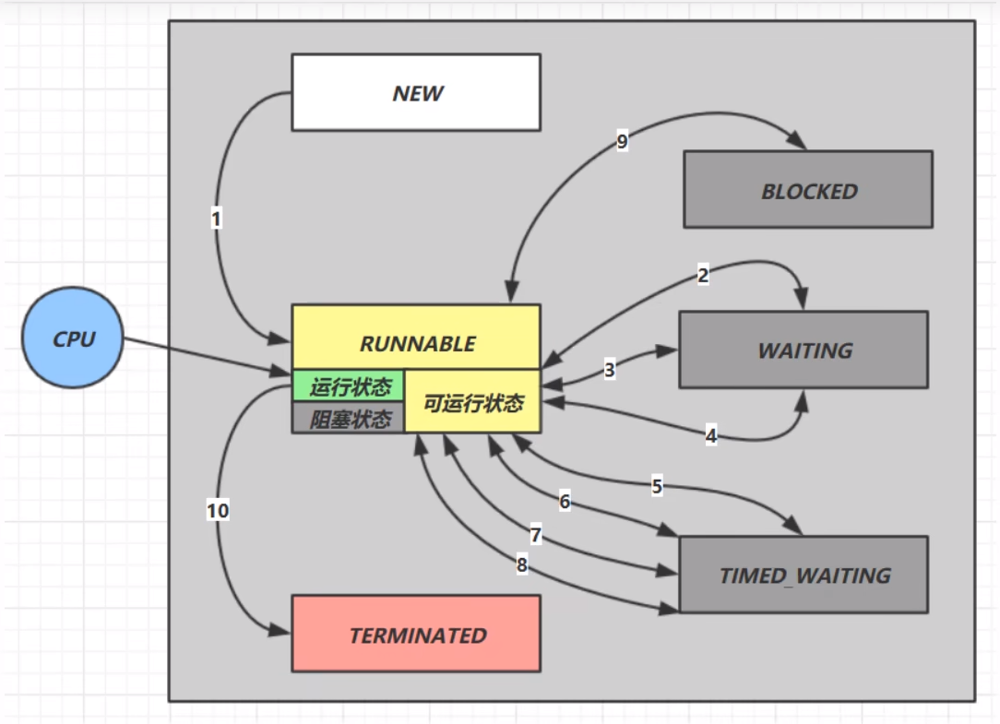
- NEW 线程刚刚被创建，但是还没有调用start()方法
  - RUNNABLE当调用start()方法之后，注意，**Java API** 层面的 *RUNNABLE*状态覆盖了操作系统层面的【可运行状态】、【运行状态】和【阻塞状态】（由于BIO导致的线程阻塞，在Java里无法区分，仍然认为是可运行）
- TERMINATED当代码运行结束

演示六种状态
```java
@Slf4j
public class Test21 {
    public static void main(String[] args) {
        Thread t1 = new Thread("t1") {
            @Override
            public void run() {
                log.debug("running");
            }
        };

        Thread t2 = new Thread("t2") {
            @Override
            public void run() {
                while (true) {} //runnable
            }
        };
        t2.start();

        Thread t3 = new Thread("t3") {
            @Override
            public void run() {
                log.debug("running");
            }
        };
        t3.start();

        Thread t4 = new Thread("t4") {
            @Override
            public void run() {
                synchronized(Test21.class) {
                    try {
                        TimeUnit.SECONDS.sleep(5);//time_waiting
                    } catch (InterruptedException e) {
                        throw new RuntimeException(e);
                    }
                }
            }
        };
        t4.start();

        Thread t5 = new Thread("t5") {
            @Override
            public void run() {
                try {
                    t2.join();//waiting 没有时限的等待
                } catch (InterruptedException e) {
                    throw new RuntimeException(e);
                }
            }
        };
        t5.start();

        Thread t6 = new Thread("t6") {
            @Override
            public void run() {
                synchronized(Test21.class) {//t6拿不到锁就会处于 blocked
                    try {
                        TimeUnit.SECONDS.sleep(5);
                    } catch (InterruptedException e) {
                        throw new RuntimeException(e);
                    }
                }
            }
        };
        t6.start();

        try {
            TimeUnit.SECONDS.sleep(1);
        } catch (InterruptedException e) {
            throw new RuntimeException(e);
        }
        log.debug("t1 state {}", t1.getState());
        log.debug("t2 state {}", t2.getState());
        log.debug("t3 state {}", t3.getState());
        log.debug("t4 state {}", t4.getState());
        log.debug("t5 state {}", t5.getState());
        log.debug("t6 state {}", t6.getState());
    }
}
```
结果
```text
21:36:04.561 [t3] DEBUG p3.t13.Test21 - running
21:36:05.563 [main] DEBUG p3.t13.Test21 - t1 state NEW
21:36:05.564 [main] DEBUG p3.t13.Test21 - t2 state RUNNABLE
21:36:05.565 [main] DEBUG p3.t13.Test21 - t3 state TERMINATED
21:36:05.565 [main] DEBUG p3.t13.Test21 - t4 state TIMED_WAITING
21:36:05.565 [main] DEBUG p3.t13.Test21 - t5 state WAITING
21:36:05.565 [main] DEBUG p3.t13.Test21 - t6 state BLOCKED
```

## 3.14应用
```java
@Slf4j
public class Test22 {
    public static void main(String[] args) {
        Thread t1 = new Thread(() -> {
            log.debug("t1-洗水壶开始");
            Sleeper.sleepBySeconds(1);
            log.debug("t1-洗完开始烧水");
            Sleeper.sleepBySeconds(7);
        }, "t1");

        Thread t2 = new Thread(() -> {
            log.debug("t2-洗茶杯，洗茶壶，拿茶叶开始");
            Sleeper.sleepBySeconds(4);
            log.debug("t2-洗完开始等水开");
            Sleeper.sleepBySeconds(5);
            try {
                t1.join();
                log.debug("t2-水烧完了，泡茶");
                Sleeper.sleepBySeconds(1);
                log.debug("t2-泡完茶结束");
            } catch (InterruptedException e) {
                throw new RuntimeException(e);
            }
        }, "t2");
        t1.start();
        t2.start();
    }
}
```

# 4.共享模型之管程
## 本章内容
- 共享问题
- synchronized
- 线程安全分析
- Monitor
- wait/notify
- 线程状态转换
- 活跃性
- Lock


## 4.1共享带来的问题
### 小故事
- 老王（操作系统）有一个功能强大的算盘，现在想把他租出去，赚点外快
- 
- 小南、小女（线程）来使用这个算盘来进行一些计算，并按照时间给老王支付费用
- 但小南不能一天24小时使用算盘，他经常要小憩一会（sleep），又或是去吃饭上厕所（阻塞io操作），有时还需要一根烟，没烟时思路全无（wait）这些情况统称为（阻塞）
- 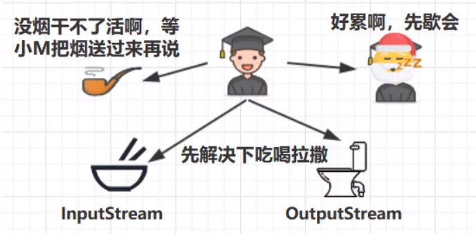
- 在这些时候，算盘没利用起来（不能收费），老王觉得不划算
- 另外，小女也想使用算盘，如果总是小南占着算盘，让小女觉得不公平
- 于是老王灵机一动，想了一个办法【让他们每个人用一会，轮流使用算盘】
- 这样，当小南阻塞的时候，算盘可以分给小女使用，不会浪费，反之亦然
- 最近执行的计算比较复杂，需要存储中间结果，而学生的脑容量不够（工作内存）不够，所以老王申请了一个笔记本（主存），把一些中间结果记在笔记本上
- 计算流程就是这样的
- 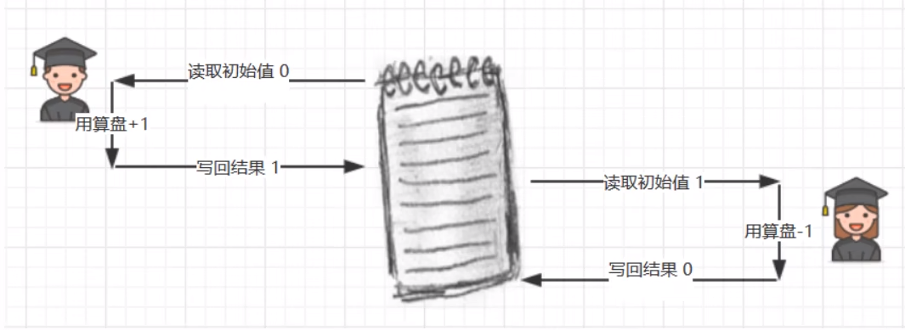
- 但是分时系统，有一天发生了事故
- 小南刚读取了一个初始值0做了+1运行，还没来的及写回结果
- 老王说【小南，你的时间到了，该别人了，记住结果吧】，于是小南念叨【结果是1，结果是1】不甘心的在一边待着（上席文切换）
- 老王说【小女，该你了】，小女看到笔记本上写着0做了-1的运行，将结果-1写入笔记本
- 这时小女的时间也用完了，老王叫醒小南【小南，把你上次的题目做完吧】，小南将结果写入笔记本
- 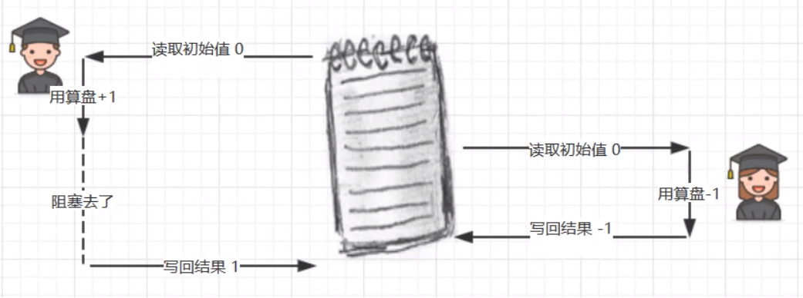
- 小南和小女都觉得自己没有做错，但笔记本上写的1而不是-1

### Java体现
两个线程对初始值为0的静态变量一个做自增，一个做自减，各做5000次，结果是0？
```java
@Slf4j
public class Test0 {
    private static int num = 0;
    public static void main(String[] args) throws InterruptedException {
        Thread t1 = new Thread(() -> {
            for (int i = 0; i < 5000; i++) {
                num++;
            }
        }, "t1");
        Thread t2 = new Thread(() -> {
            for (int i = 0; i < 5000; i++) {
                num--;
            }
        }, "t2");
        t1.start();
        t2.start();
        t1.join();
        t2.join();
        log.debug("num = {}", num);
    }
}
```

### 问题分析
以上结果可能是正数，负数，零。为什么呢？因为Java中对静态变量的自增，自减不是原子性的，要彻底解决，必须从字节码来进行分析

例如对于i++而言（i为静态变量），实际会产生如下JVM字节码指令
```text
getstatic i //获取静态变量
iconst_1    //准备常量1
iadd           //自增
putstatic   //将修改后的值存入静态变量i中
```

对于i--类似
```text
getstatic i //获取静态变量
iconst_1    //准备常量1
isub           //自增
putstatic   //将修改后的值存入静态变量i中
```
而Java中的内存模型如下，完成静态变量的自增，自减需要在主存和工作内存中的数据进行交换
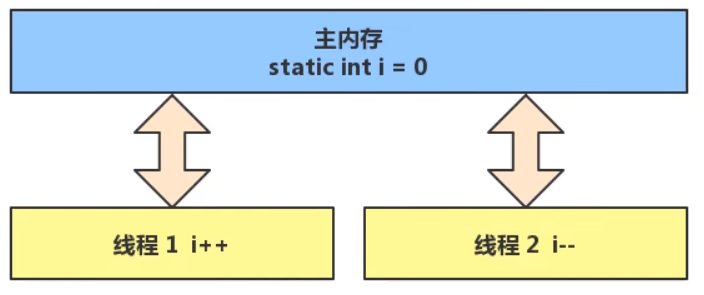
如果是单线程以上8行代码是顺序执行（不会交错）没有问题
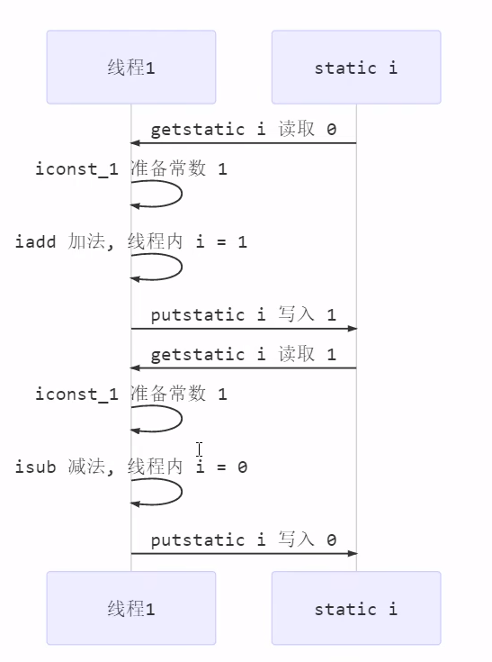
出现负数情况
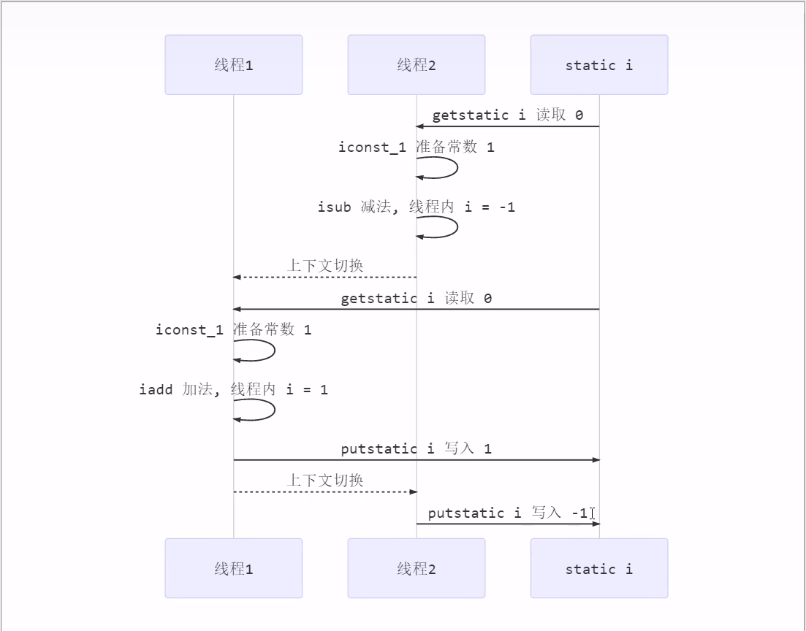
出现正数的情况
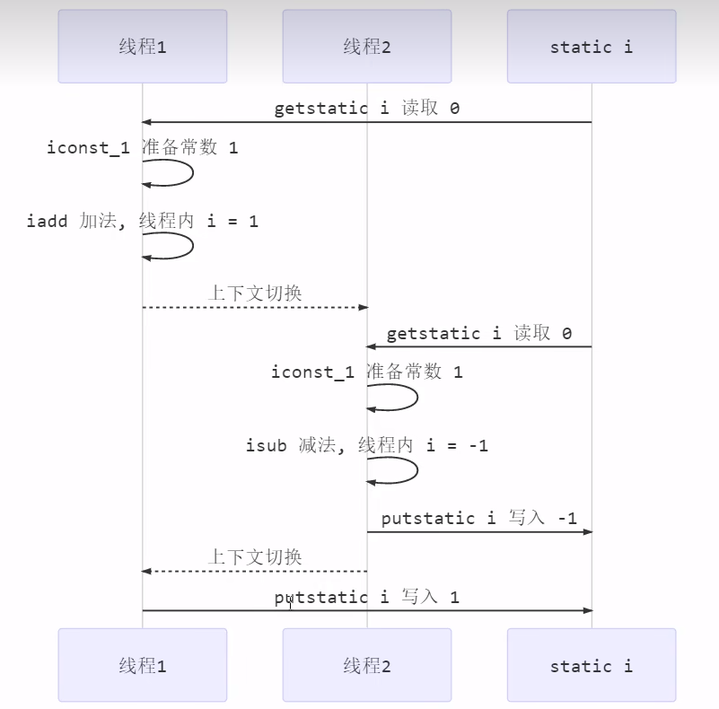


### 临界区 Critical Section
- 一个程序运行多个线程本身没有问题
- 问题出现在多个线程访问**共享资源**
  - 多个线程读取**共享资源**也是没有问题的
  - 在多个线程对**共享资源**读写操作时发生指令交错，就会出现问题
- 一段代码块内如果存在对**共享资源**的多线程读写操作，这段代码块叫**临界区**

例如，下面的代码中的临界区
```java
public class A {
    static int num = 0;
    static void increment() {//临界区
        num++;
    }
  static void decrement() {//临界区
        num--;
  }
}
```
### 竟态条件Race Condition
多线程在临界区内执行，由于代码的**执行序列**不同而导致结果无法预测，称之位发生了**竟态条件**


## 4.2 synchronized解决方案
### <font color="green" >应用之互斥</font>
为了避免临界区的竟态条件的发生，有多种手段可以达到目的
- 阻塞式的解决方案：synchronized，Lock
- 非阻塞式的解决方案：原子变量

本次课使用阻塞式的解决方案: synchronized，来解决上述问题，即俗称的【对象锁】，它采用互斥的万式让同一时刻至多只有一个线程能持有【对象锁】，其它线程再想获取这个【对象锁】时就会阻塞住。这样就能
保证拥有锁的线程可以安全的执行临界区内的代码，不用担心线程上下文切换
> **注意**
> 虽然java中互斥和同步都可以采用synchronized关键字来完成，但他们还是由去别的
> - 互斥是保证临界区的竟态条件发生，同一时刻只能有一个线程执行临界区代码
> - 同步是由于线程执行先后，顺序不同，需要一个线程等待其他线程运行到某个点
> 
### synchronized
语法
```text
synchronized() {
    临界区
}
```
解决
```java
@Slf4j
public class Test0 {
  private static int num = 0;
  private static  Object lock = new Object();
  public static void main(String[] args) throws InterruptedException {
    Thread t1 = new Thread(() -> {
      for (int i = 0; i < 5000; i++) {
        synchronized (lock) {
          num++;
        }
      }
    }, "t1");
    Thread t2 = new Thread(() -> {
      for (int i = 0; i < 5000; i++) {
        synchronized (lock) {
          num--;
        }
      }
    }, "t2");
    t1.start();
    t2.start();
    t1.join();
    t2.join();
    log.debug("num = {}", num);
  }
}
```
理解
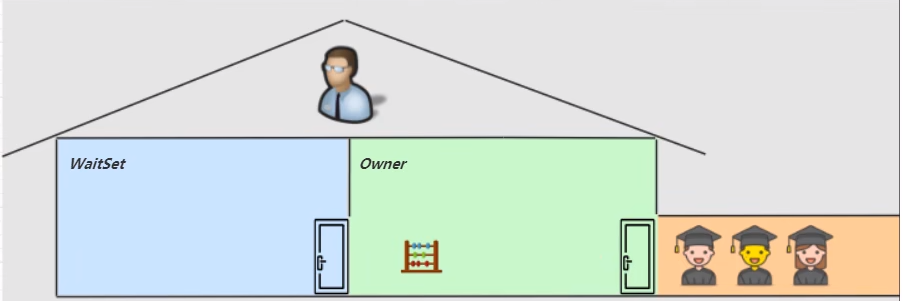
类比:
- synchronized(对象)中的对象，可以理解为一个房间（room），有唯一的入口*（门），只能一次进入一个人进行计算，t1和t2想象成两个人
- 当线程t1执行到synchronized(room)时就好比t1进入了这个房间，并锁住了门拿走了钥匙，在门内执行count++代码
- 这时候如果t2也运行到了synchronized( room)时，它发现门被锁住了，只能在门外等待，发生了上下文切换，阻塞住了
- 这中间即使t1的cpu时间片不幸用完，被踢出了门外(不要错误理解为锁住了对象就能一直执行下去哦)，这时门还是锁住的，t1仍拿着钥匙,t2线程还在阻塞状态进不来，只有下次轮到t1自己再次获得时间片时才能开门进入
- 当t1执行完 synchronized{}块内的代码，这时候才会从 obj房间出来并解开门上的锁，唤醒t2线程把钥匙给他。t2线程这时才可以进入 obj房间，锁住了门拿上钥匙,执行它的count--代码

思考
synchronized实际是用**对象锁**保证了**临界区内代码的原子性**，临界区内的代码对外是不可分割的，不会被线程切换打断

加深理解
- 如果把synchronized(obj) 方法循环外，如何理解？
- 如果t1 synchronized(obj1)，t2 synchronized(obj2)会怎样运行？
> 锁不一样，对应的房间不同，门不同，就没有失去了原子性
- 如果t1 synchronized(obj)，t2没有加如何理解？
> t2操作共享资源不需要进入房间里了，当然就不需要去获取钥匙，也就不需要等待t1了，不会被阻塞
- 利用synchronized + join() 写一个死锁
```java
@Slf4j
public class Test0 {
    private static int num = 0;
    private static  Object lock = new Object();
    public static void main(String[] args) throws InterruptedException {
        Thread t1 = new Thread(() -> {
            for (int i = 0; i < 5000; i++) {
                synchronized (lock) {
                    num++;
                }
            }
        }, "t1");
        Thread t2 = new Thread(() -> {
            for (int i = 0; i < 5000; i++) {
                synchronized (lock) {
                    num--;
                }
            }
        }, "t2");
        t1.start();
        t2.start();
        t1.join();
        t2.join();
        log.debug("num = {}", num);
    }
}
```

### 面对对象写法
```java
@Slf4j
public class Test3 {
    public static void main(String[] args) throws InterruptedException {
        Room room = new Room();
        Thread t1 = new Thread(() -> {
            for (int i = 0; i < 5000; i++) {
                room.increment();
            }
        }, "t1");
        Thread t2 = new Thread(() -> {
            for (int i = 0; i < 5000; i++) {
                room.decrement();
            }
        }, "t2");
        t1.start();
        t2.start();
        t1.join();
        t2.join();
        log.debug("num = {}", room.getNum());
    }
}

class Room {
    private int num;

    public void increment() {
        synchronized (this) {
            num++;
        }
    }
    public void decrement() {
        synchronized (this) {
            num--;
        }
    }
    public int getNum() {
        synchronized (this) {
            return num;
        }
    }
}
```
## 4.3方法上的synchronized
### 非static方法上
```java
class Test {
    public synchronized  void test() {
    }
}
//等价于
class Test {
  public  void test() {
    synchronized (this) {
    }
  }
}
```
### static方法上
```java
class Test {
    public synchronized static void test() {
    }
}
//等价于
class Test {
    public static void test() {
        synchronized (Test.class) {
        }
    }
}
```
### 不加synchronized的方法
不加synchronization的方法就好比不遵守规则的人，不老实去排队（翻窗户进去）

### 所谓的”线程八锁“
其实就是考察synchronized锁住的是哪个对象
- 如果是类对象，注意内存中一个类有且只有一个类对象
- 如果是this，可以直接看这个this指的是否是同一个对象的地址

情况一
```java
@Slf4j
public class Test0 {
    public static void main(String[] args) {
        Number number = new Number();
        new Thread(() -> {
            log.debug("begin");
            number.a();
        }).start();
        new Thread(() -> {
            log.debug("begin");
            number.b();
        }).start();

    }
}
@Slf4j
class Number {
    public synchronized void a() {
        log.debug("1");
    }
    public synchronized void b() {
        log.debug("2");
    }
}
```
情况二
```java
@Slf4j
public class Test0 {
    public static void main(String[] args) {
        Number number = new Number();
        new Thread(() -> {
            Sleeper.sleepBySeconds(1);
            log.debug("begin");
            number.a();
        }).start();
        new Thread(() -> {
            log.debug("begin");
            number.b();
        }).start();
    }
}
@Slf4j
class Number {
    public synchronized void a() {
        log.debug("1");
    }
    public synchronized void b() {
        log.debug("2");
    }
}
```
情况三
```java
@Slf4j
public class Test1 {
    public static void main(String[] args) {
        Number number = new Number();
        new Thread(() -> {
            Sleeper.sleepBySeconds(1);
            log.debug("begin");
            number.a();
        }).start();
        new Thread(() -> {
            log.debug("begin");
            number.b();
        }).start();
        new Thread(() -> {
            log.debug("begin");
            number.c();
        }).start();
    }
}
```
情况四
```java
@Slf4j
public class Test2 {
  public static void main(String[] args) {
    Number number1 = new Number();
    Number number2 = new Number();
    new Thread(() -> {number1.a();}).start();
    new Thread(() -> {number2.b();}).start();
  }
}
```
> a，b方法的锁都是**this**但是this所指的对象不同

情况五
```java
@Slf4j
public class Test3 {
    public static void main(String[] args) {
        Num num = new Num();
        new Thread(() -> num.a()).start();
        new Thread(() -> num.b()).start();
    }
}
@Slf4j
class Num {
    public static synchronized void a() {
        Sleeper.sleepBySeconds(1);
        log.debug("1");
    }
    public synchronized void b() {
        log.debug("2");
    }
}
```
> a方法的锁是Num.class，b方法的锁是this，运行不是互斥的

情况六
```java
@Slf4j
public class Test3 {
    public static void main(String[] args) {
        Num num = new Num();
        new Thread(() -> num.a()).start();
        new Thread(() -> num.b()).start();
    }
}
@Slf4j
class Num {
    public static synchronized void a() {
        Sleeper.sleepBySeconds(1);
        log.debug("1");
    }
    public static synchronized void b() {
        log.debug("2");
    }
}
```
> 锁都是Num.class
> 
情况七
```java
@Slf4j
public class Test3 {
  public static void main(String[] args) {
    Num num1 = new Num();
    Num num2 = new Num();
    new Thread(() -> num1.a()).start();
    new Thread(() -> num2.b()).start();
  }
}

@Slf4j
class Num {
    public static synchronized void a() {
        Sleeper.sleepBySeconds(1);
        log.debug("1");
    }
    public synchronized void b() {
        log.debug("2");
    }
}
```
> 锁对象不同
> 
情况八
```java
@Slf4j
public class Test3 {
  public static void main(String[] args) {
    Num num1 = new Num();
    Num num2 = new Num();
    new Thread(() -> num1.a()).start();
    new Thread(() -> num2.b()).start();
  }
}
@Slf4j
class Num {
    public static synchronized void a() {
        Sleeper.sleepBySeconds(1);
        log.debug("1");
    }
    public static synchronized void b() {
        log.debug("2");
    }
}
```
> 锁是类对象，虽然num1和num2不同，但是他们类对象是相同的，所以是互斥的
> 


## 4.4 变量的线程安全分析
### 成员变量和静态变量是否是线程安全的
- 如果他们没有没共享，则线程安全
- 如果他们被共享了，根据他们的状态是否能够改变，分两种情况
  - 如果只是读操作，则线程安全
  - 如果是读写操作，则这段代码是临界区，需要考虑线程安全

### 局部变量是否是线程安全的
- 局部变量是线程安全的
- 但局部变量引用的对象则未必
  - 如果该对象没有逃离方法的作用范围，他是线程安全的
  - 如果该对象逃离了方法的作用范围，需要考虑线程安全

### 局部变量线程安全分析
每个线程调用方法操作局部变量i时，因为每一线程有属于自己的栈帧，而局部变量在自己的栈帧里，所以不存在共享，是线程安全的

***局部变量引用对象稍有不同***
```java
public class Test0 {
  private static final int THREAD_NUMBER = 2;
  private static final int LOOP_NUMBER = 200;

  public static void main(String[] args) {
    ThreadUnsafe test = new ThreadUnsafe();
//        ThreadSafe test = new ThreadSafe();
    for (int i = 0; i < THREAD_NUMBER; i++) {
      new Thread(() -> {
        test.method1(LOOP_NUMBER);
      }, "Thread"+(i+1)).start();
    }
  }

}
class ThreadUnsafe {
  ArrayList<String> list = new ArrayList<String>();
  public void method1(int loopNumber) {
    for (int i = 0; i < loopNumber; i++) {
      method2();
      method3();
    }
  }
  private void method2() {
    list.add("1");
  }
  private void method3() {
    list.remove(0);
  }
}

class ThreadSafe {
  public void method1(int loopNumber) {
    ArrayList<String> list = new ArrayList<String>();
    for (int i = 0; i < loopNumber; i++) {
      method2(list);
      method3(list);
    }
  }
  private void method3(ArrayList<String> list) {
    list.remove(0);
  }
  private void method2(ArrayList<String> list) {
    list.add("1");
  }

}
```
> 可能一个线程还未add，另一个线程就remove就会报错

分析
- 无论哪个线程中的method2引用的都是对象中的list成员变量
- method3 和 method2相同
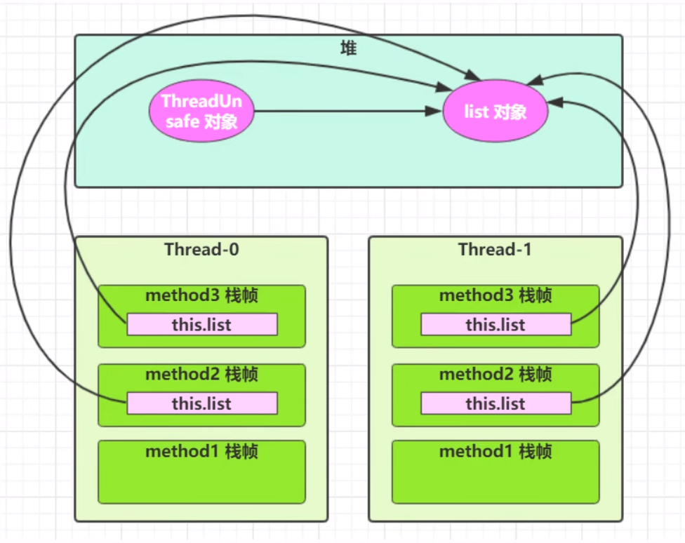

将list修改为局部变量
```java
public class Test0 {
    private static final int THREAD_NUMBER = 2;
    private static final int LOOP_NUMBER = 200;

    public static void main(String[] args) {
//        ThreadUnsafe test = new ThreadUnsafe();
        ThreadSafe test = new ThreadSafe();
        for (int i = 0; i < THREAD_NUMBER; i++) {
            new Thread(() -> {
                test.method1(LOOP_NUMBER);
            }, "Thread"+(i+1)).start();
        }
    }

}
class ThreadUnsafe {
    ArrayList<String> list = new ArrayList<String>();
    public void method1(int loopNumber) {
        for (int i = 0; i < loopNumber; i++) {
            method2();
            method3();
        }
    }
    private void method2() {
        list.add("1");
    }
    private void method3() {
        list.remove(0);
    }
}

class ThreadSafe {
    public void method1(int loopNumber) {
        ArrayList<String> list = new ArrayList<String>();
        for (int i = 0; i < loopNumber; i++) {
            method2(list);
            method3(list);
        }
    }
    private void method3(ArrayList<String> list) {
        list.remove(0);
    }
    private void method2(ArrayList<String> list) {
        list.add("1");
    }

}
```
就不会由上面的问题

分析:
- list是局部变量，每个线程调用时会创建其不同实例，没有共享
- 而method2的参数是从method1中传递过来的，与method1中引用同一个对象
- method3和method2相同
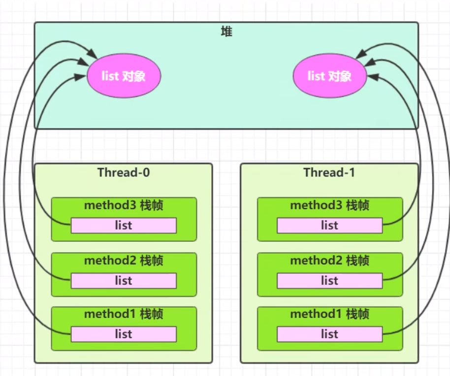

方法访问修饰符带来的思考，如果把 method2和method3的方法修改为public会不会代理线程安全问题?
- 情况一：有其他线程调用method2和method3
- 情况二：在情况1的基础上，为ThreadSafe创建一个子类，子类覆盖method2或method3及
  
我的理解是
>去new了一个Thread并且使用了共享变量，在最后的method3中去new了Thread并且使用了method1中的局部变量，所以list变成了共享变量了
```java
public class Test0 {
    private static final int THREAD_NUMBER = 2;
    private static final int LOOP_NUMBER = 200;

    public static void main(String[] args) {
//        ThreadUnsafe test = new ThreadUnsafe();
//        ThreadSafe test = new ThreadSafe();
        ThreadSafeSubClass test = new ThreadSafeSubClass();
        for (int i = 0; i < THREAD_NUMBER; i++) {
            new Thread(() -> {
                test.method1(LOOP_NUMBER);
            }, "Thread"+(i+1)).start();
        }
    }

}
class ThreadUnsafe {
    ArrayList<String> list = new ArrayList<String>();
    public void method1(int loopNumber) {
        for (int i = 0; i < loopNumber; i++) {
            method2();
            method3();
        }
    }
    private void method2() {
        list.add("1");
    }
    private void method3() {
        list.remove(0);
    }
}

class ThreadSafe {
    public void method1(int loopNumber) {
        ArrayList<String> list = new ArrayList<String>();
        for (int i = 0; i < loopNumber; i++) {
            method2(list);
            method3(list);
        }
    }
    public void method3(ArrayList<String> list) {
        list.remove(0);
    }
    public void method2(ArrayList<String> list) {
        list.add("1");
    }
}

class ThreadSafeSubClass extends ThreadSafe{
    @Override
    public void method3(ArrayList<String> list) {
        new Thread(() -> {
            list.remove(0);
        }).start();
    }
}
```
结论
- 方法的访问修饰符一定层度上可以保护方法的线程安全
- 方法的final也有这样的效果
> 例子中可以知道private和final提供的【安全】的意义所在，体会开闭原则的【闭】
> 

### 常见的线程安全类
- String
- Integer等包装类
- StringBuffer
- Random
- Vector
- Hashtable
- java.util.concurrent包下的类

这里说他们是线程安全的是指，多个线程调用他们同一个实例的某个方法时，实线程安全的。也可以理解为
- 他们的每个方法时原子的
- 但**注意**他们多个方法的组合不是原子的，见后分析

### 线程安全类方法组合
分析下面的代码时线程安全的吗？

```java
import java.util.Hashtable;

class Test {
  public static void main(String[] args) {
    Hashtable hashtable = new Hashtable();
    //线程1，线程2
    if (hashtable.get("key") == null) {
        hashtable.put("key", "value");
    }
  }
}
```
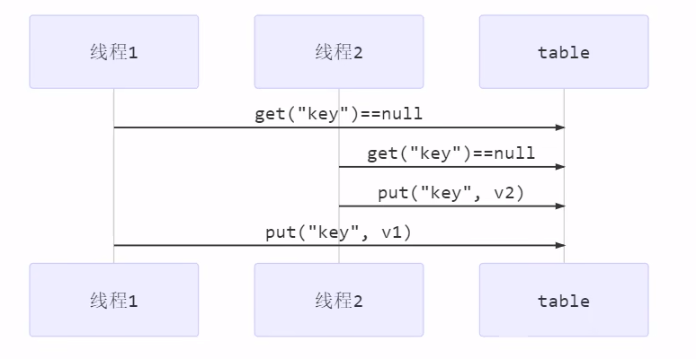

### 不可变线程安全性
String、Integer等都是不可变类，因为其内部的状态不可以改变，因此它们的方法都是线程安全的
有同学或许有疑问，String有replace，subString【可以】改变值啊，那么这些方法又是如何保证线程安全的呢?
> String类的操作字符串的方法都是没有修改原来的字符串，而是在原有的字符对象的值的基础上经过不同方法的操作去创建一个新的String对象并进行赋值，从没有修改过原来的String对象的值
> 

### 实例分析
例一
```java
import java.util.Date;
import java.util.HashMap;

public class MyServlet extends HttpServlet {
  //不安全
  Map<String, String> map = new HashMap();
  Date date1 = new Date();
  final Date date2 = new Date();//只是date2的引用值无法改变，但date2对象的属性可以被修改
  //安全
  String s1 = "...";
  final String s2 = "...";
  public void doGet(Request request, Response response) {
      //使用上面的变量
  }
  
}
```
例二
```java
public class MyServlet extends HttpServlet {
    //不是线程安全的
    private UserServiceImpl userService = new UserServiceImpl();
    public void doGet(Request request, Response response) {
      
        userService.update();
  }
}

public class UserServiceImpl implements UserService {
    //记录调用次数
  private int count = 0;
  public void update() {
      count++;
  }
}
```
例三

```java
@Aspect
@Commont
public class MyAspect {
  //线程安全，Spring默认对象单例的那他就会存在共享问题，也就存在线程安全问题
  private long start = 0L;

  @Before("execution(* *(...))")
  public void before() {
    start = System.nanoTime();
  }

  @After("execution(* *(...))")
  public after() {
    long end = System.nanoTime();
    System.out.println("cost time:" + (end - start));
  }
}
```
例四

```java
public class MyServlet extends HttpServlet {
  //是线程安全的
  private UserServiceImpl userService = new UserServiceImpl();
  public void doGet(Request request, Response response) {

  }
}

public class UserServiceImpl implements UserService {
  //userDao是线程安全的，以为uerDao中没有属性可以修改，没有共享变量，线程安全
  private UserDaoImpl userDao = new UserDaoImpl();

  public void update() {
    userDao.update();
  }
}

public class UserDaoImpl implements UserDao {
  //sql是线程安全的
  String sql = "update user set email = ? where id = ?";
  public void update() {
      //con是线程安全的，方法中的局部变量
      try (Connection con = DriverManager.getConnection("","","")) {
        //...
      }catch (Exception e) {
        //...
    }
  }
}
```

例五

```java
import java.sql.Connection;

public class MyServlet extends HttpServlet {
  private UserServiceImpl userService = new UserServiceImpl();

  public void doGet(Request request, Response response) {

  }
}

public class UserServiceImpl implements UserService {
  private UserDaoImpl userDao = new UserDaoImpl();

  public void update() {
    userDao.update();
  }
}

public class UserDaoImpl implements UserDao {
  //存在线程安全，可能一个线程new Connection，另一个线程赋值为null或者执行了close()方法，第一个线程就会空指针异常
  private Connection con = null;
  public void update() {
    String sql = "update user set email = ? where id = ?";
    con = DriverManager.getConnection("","","");
    //...
    con.close();
  }
}
```
例六
```java
import java.sql.Connection;

public class MyServlet extends HttpServlet {
  private UserServiceImpl userService = new UserServiceImpl();

  public void doGet(Request request, Response response) {

  }
}

public class UserServiceImpl implements UserService {
  private UserDaoImpl userDao = new UserDaoImpl();

  public void update() {
    //这样就解决了UserDaoImpl中的线程安全问题，每个线程中的con都不同，不存在共享变量
    UserDaoImpl userDao = new UserDaoImpl();
    userDao.update();
  }
}

public class UserDaoImpl implements UserDao {
  //存在线程安全，可能一个线程new Connection，另一个线程赋值为null或者执行了close()方法，第一个线程就会空指针异常
  private Connection con = null;
  public void update() {
    String sql = "update user set email = ? where id = ?";
    con = DriverManager.getConnection("","","");
    //...
    con.close();
  }
}
```
例七

```java
public abstract class Test {
  public void bar() {
    SimpleDateFormat sdf = new SimpleDateFormat("yyyy-MM-dd");
    /*这里虽然sdf是方法中的局部变量，但是foo()方法是抽象方法，
   子类可能创建新的线程操作sdf，这样sdf在子类foo()方法中
   成为了共享变量
     */
    foo(sdf);
  }
  public abstract void foo(SimpleDateFormat sdf);
  
  public static void main(String[] args) {
      new Test().bar();
  }
}
```
> 这里虽然sdf是方法中的局部变量，但是foo()方法是抽象方法，
子类可能创建新的线程操作sdf，这样sdf在子类foo()方法中
成为了共享变量
> 
## 4.5习题
```java
@Slf4j
public class Sell {
    private static int all = 4000;
    public static void main(String[] args) throws InterruptedException {
        //模拟多人买票
        TicketWindow window = new TicketWindow(all);
        //统计卖出的票
        List<Integer> amountList = new Vector<>();
        //统计线程集合
        List<Thread> threads = new ArrayList<>();
        for (int i = 0; i < 2000; i++) {
            Thread thread = new Thread(() -> {
                //随机生成票数
                int random = randomAmount();
                amountList.add(window.sell(random));
                //模拟等待
                try {
                    Thread.sleep(randomAmount()*2L);
                } catch (InterruptedException e) {
                    throw new RuntimeException(e);
                }
            });
            threads.add(thread);
            thread.start();
        }
        for (Thread thread : threads) {
            thread.join();
        }
        //实际剩余
        log.debug("剩余: {}", (window.getCount()));
        //理论剩余
        log.debug("卖出: {}",  amountList.stream().mapToInt(i->i).sum());
        log.debug("卖出: {}",  (all-amountList.stream().mapToInt(i->i).sum()));
    }

    static Random random = new Random();
    public static int randomAmount() {
        return random.nextInt(5)+1;
    }
}
```
```java
@Slf4j
public class Transfer {

    public static void main(String[] args) throws InterruptedException {
        Account a1 = new Account(1000);
        Account a2 = new Account(1000);
        Thread t1 = new Thread(() -> {
            for (int i = 0; i < 1000; i++) {
                a1.transfer(a2, randomAmount());
            }
        });
        Thread t2 = new Thread(() -> {
            for (int i = 0; i < 1000; i++) {
                a2.transfer(a1, randomAmount());
            }
        });
        t1.start();
        t2.start();
        t1.join();
        t2.join();
        log.debug("a1 count: " + a1.getCount());
        log.debug("a2 count: " + a2.getCount());
        log.debug("all count: " + (a2.getCount()+a1.getCount()));
    }
    static Random random = new Random();
    public static int randomAmount() {
        return random.nextInt(100)+1;
    }
}
class Account {
    private int count = 0;

    public Account(int count) {
        this.count = count;
    }

    public int getCount() {
        return count;
    }

    public void setCount(int count) {
        this.count = count;
    }

    public void transfer(Account target, int num) {
        //这里有两个对象所以不能直接使用this，那样只能锁一个
        synchronized (Account.class) {
            if (this.count >= num) {
                this.setCount(this.count-num);
                target.setCount(target.getCount()+num);
            }
        }
    }
}
```

## 4.6 Monitor概念
### Java对象头
以32位虚拟机为例
普通对象
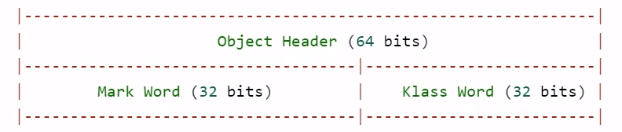
数组对象
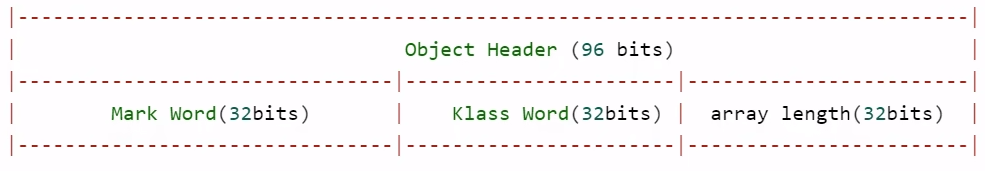
其中MarkWord
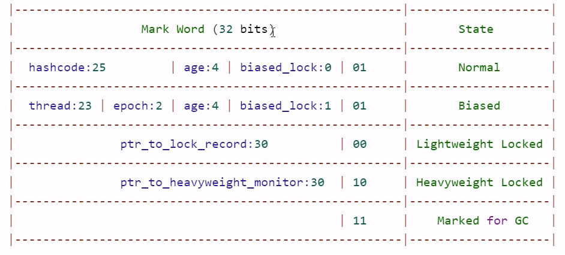

### Monitor
Monitor被翻译为**监视器**或**管程**
每个Java对象都可以关联一个Monitor对象，如果使用synchronized给对象上锁（重量级）之后，该对象头的Mark Word中就被设置指向Monitor对象的指针

Monitor结构如下
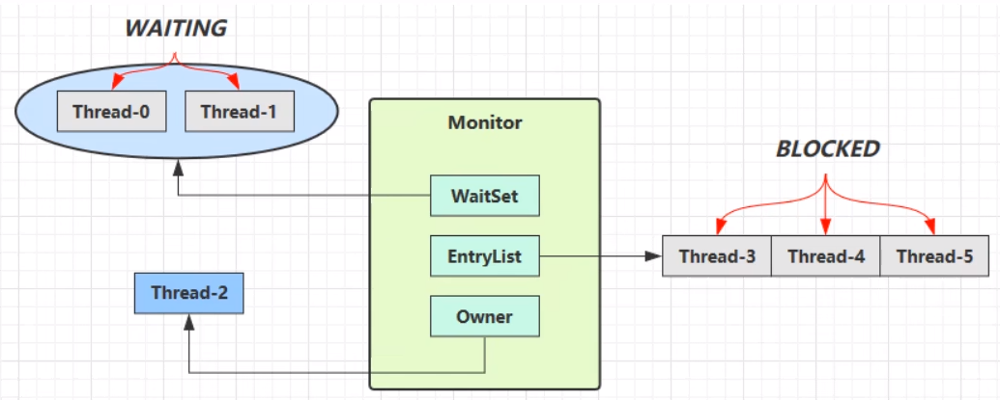
- 刚开始Monitor中的Owner为null
- 当Thread-2执行synchronized(obj)就会将Monitor的所有者Owner 置为Thread-2，Monitor中只能有一个Owner
- 在Thread-2上锁的过程中，如果Thread-3，Thread-4，Thread-5也来执行synchronized(obj)，就会进入EntryList BLOCKED
- Thread-2执行完同步代码块的内容，然后唤醒EntryList 中等待的线程来竞争锁，竞争的时是非公平的
- 图中 WaitSet 中的Thread-0，Thread-1是之前获得过锁，但条件不满足进入WAITING 状态的线程 后面 讲wait-notify时会分析
> 注意
> - synchronized必须是进入同一个对象的monitor才有上述效果
> - 不加synchronized的对象不会关联监视器，不遵守以上规则

### 小故事


### synchronized原理
[并发编程原理18页](pdf/并发编程_原理.pdf)

## 4.7 wait notify
### 小故事 -为什么需要wait
- 由于条件不满足，小南不能继续计算
- 但小南一直占用锁，其他人就得一直阻塞，效率太低
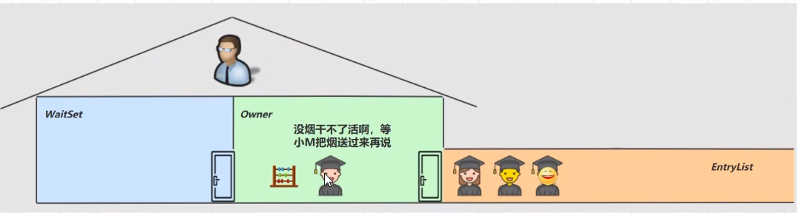
- 于是老王单开了一间休息室（调用wait()方法），让小南到休息室（WaitSet）等着去了，但这时锁释放了，其他人就可以由老王随机安排进入房间
- 知道小M将烟送来，大叫一声【小南你的烟来了】（调用notify()方法）
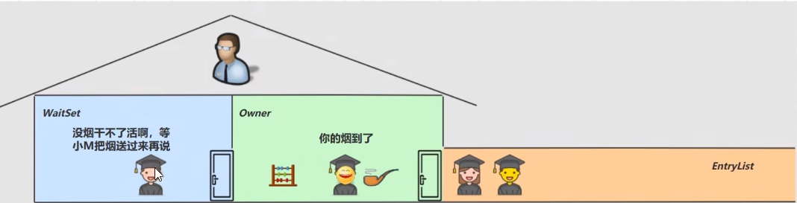
- 小南于是可以离开休息室，重新进入竞争锁的队列
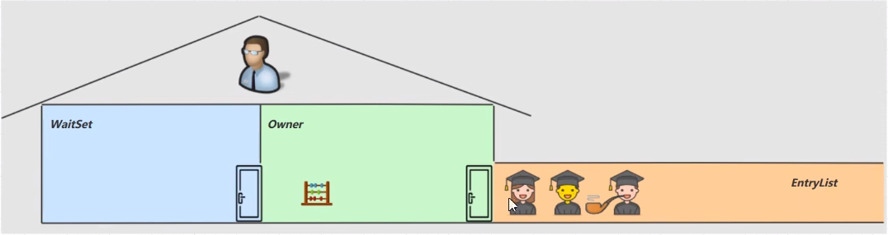

### wait/notify原理
[wait/notify原理 P33](pdf/并发编程_原理.pdf)

### API介绍
- obj.wait() 让进入object监视器的线程到WaitSet等待
- obj.notify() 在object上正在WaitSet等待的线程中挑一个唤醒
- obj.notifyAll() 让object上正在WaitSet等待的线程全部唤醒

他们都是线程之间进行协作的手段，都属于Object对象的方法。必须获得此对象的锁，才能调用这几个方法
```java
@Slf4j
public class Test1 {
    final static Object lock = new Object();
    public static void main(String[] args) {
        new Thread(() -> {
            synchronized (lock) {
                log.debug("t1执行");
                try {
                    lock.wait();//让t1线程等待
                } catch (InterruptedException e) {
                    throw new RuntimeException(e);
                }
                log.debug("t1的其他代码");
            }
        }, "t1").start();
        new Thread(() -> {
            synchronized (lock) {
                log.debug("t2执行");
                try {
                    lock.wait();//让t2线程等待
                } catch (InterruptedException e) {
                    throw new RuntimeException(e);
                }
                log.debug("t2的其他代码");
            }
        }, "t2").start();
        //主线程
        Sleeper.sleepBySeconds(1);
        log.debug("唤醒lock其他线程");
        synchronized (lock) {
//            lock.notify();//唤醒一个
            lock.notifyAll();//唤醒所有
        }
    }
}
```

## 4.8 wait notify 的正确姿势
开始之前先看看
### sleep(long n)和wait(long n)的区别
- sleep是线程Thread的方法，而wait是Object方法
- sleep不需要和synchronized配合使用，而wait需要
- sleep在睡眠的同时，不会释放对象锁，但是wait等待的时候会释放对象锁

- 线程 的状态相同TIMED_WAITING

```java
@Slf4j
public class Test0 {
    static final Object lock = new Object();
    public static void main(String[] args) {
        new Thread(() -> {
            synchronized (lock) {
                log.debug("获得锁");
//                Sleeper.sleepBySeconds(2);
                try {
                    lock.wait(2000);
                } catch (InterruptedException e) {
                    throw new RuntimeException(e);
                }
            }
        }).start();
        Sleeper.sleepBySeconds(1);
        synchronized (lock) {
            log.debug("获得锁");
        }
    }
}
```

### step 1
```java
@Slf4j
public class Test1 {
    static final Object lock = new Object();
    static boolean hasCigarette = false;//有没有烟
    static boolean hasTakeout = false;
    public static void main(String[] args) {
        new Thread(() -> {
            synchronized (lock) {
                log.debug("获得锁");
                log.debug("有烟没?[{}]", hasCigarette);
                if (!hasCigarette) {
                    log.debug("没烟先休息一会");
                    Sleeper.sleepBySeconds(2);
                }
                log.debug("有烟没?[{}]", hasCigarette);
                if (hasCigarette) {
                    log.debug("可以开始干活");
                }
            }
        }, "小南").start();
        for (int i = 0; i < 5; i++) {
            new Thread(() -> {
                synchronized (lock) {
                    log.debug("可以开始干活了");
                }
            }, "其他人").start();
        }

        Sleeper.sleepBySeconds(1);
        new Thread(() -> {
            hasCigarette = true;
            log.debug("烟送到");
        }, "送烟的").start();
    }
}
```
问题
- 其他干活的线程都阻塞了，效率太低了
- 小南线程必须睡满2s后才能醒来，看烟有没有送到
  - 烟提前送到，也没有用，因为小南没有醒来
  - 烟如果没有送来，小南就不会干活
- 加了synchronized (room)后，就好比小南在里面反锁了门睡觉，烟根本没法送进门，main 没加synchronized就好像main线程是翻窗户进来的

解决方案
- 使用wait / notify机制
```java
@Slf4j
public class Test1 {
    static final Object lock = new Object();
    static boolean hasCigarette = false;//有没有烟
    static boolean hasTakeout = false;
    public static void main(String[] args) {
        new Thread(() -> {
            synchronized (lock) {
                log.debug("获得锁");
                log.debug("有烟没?[{}]", hasCigarette);
                if (!hasCigarette) {
                    log.debug("没烟先休息一会");
//                    Sleeper.sleepBySeconds(2);
                    try {
                        lock.wait(2000);
                    } catch (InterruptedException e) {
                        throw new RuntimeException(e);
                    }
                }
                log.debug("有烟没?[{}]", hasCigarette);
                if (hasCigarette) {
                    log.debug("可以开始干活");
                }
            }
        }, "小南").start();
        for (int i = 0; i < 5; i++) {
            new Thread(() -> {
                synchronized (lock) {
                    log.debug("可以开始干活了");
                }
            }, "其他人").start();
        }

        Sleeper.sleepBySeconds(1);
        new Thread(() -> {
            synchronized(lock) {
                hasCigarette = true;
                log.debug("烟送到");
                lock.notify();//叫醒小南
            }
        }, "送烟的").start();
    }
}
```
问题:
- 如果还有其他线程进入等待状态，而送烟的线程错误的叫醒了其他线程，而没有叫醒小南怎么办

解决
- 使用notifyAll
```java
@Slf4j
public class Test1 {
    static final Object lock = new Object();
    static boolean hasCigarette = false;//有没有烟
    static boolean hasTakeout = false;
    public static void main(String[] args) {
        new Thread(() -> {
            synchronized (lock) {
                log.debug("获得锁");
                log.debug("有烟没?[{}]", hasCigarette);
                if (!hasCigarette) {
                    log.debug("没烟先休息一会");
//                    Sleeper.sleepBySeconds(2);
                    try {
                        lock.wait(2000);
                    } catch (InterruptedException e) {
                        throw new RuntimeException(e);
                    }
                }
                log.debug("有烟没?[{}]", hasCigarette);
                if (hasCigarette) {
                    log.debug("可以开始干活");
                }else {
                    log.debug("不干活");
                }
            }
        }, "小南").start();
        new Thread(() -> {
            synchronized (lock) {
                log.debug("获得锁");
                log.debug("有披萨没?[{}]", hasCigarette);
                if (!hasTakeout) {
                    log.debug("没披萨先休息一会");
                    try {
                        lock.wait();
                    } catch (InterruptedException e) {
                        throw new RuntimeException(e);
                    }
                }
                log.debug("有披萨没?[{}]", hasCigarette);
                if (hasTakeout) {
                    log.debug("可以开始干活");
                }else {
                    log.debug("不干活");
                }
            }
        }, "小女").start();
        Sleeper.sleepBySeconds(1);
        new Thread(() -> {
            synchronized(lock) {
                hasTakeout = true;
                log.debug("披萨送到");
//                lock.notify();//能准确的叫醒小女吗
                lock.notifyAll();
            }
        }, "送披萨的").start();
    }
}
```
问题
- 小南被叫醒了，但是没有活做

```java
package p4.t8;

import lombok.extern.slf4j.Slf4j;
import util.Sleeper;

@Slf4j
public class Test1 {
    static final Object lock = new Object();
    static boolean hasCigarette = false;//有没有烟
    static boolean hasTakeout = false;
    public static void main(String[] args) {
        new Thread(() -> {
            synchronized (lock) {
                log.debug("获得锁");
                log.debug("有烟没?[{}]", hasCigarette);
                while (!hasCigarette) {
                    log.debug("没烟先休息一会");
//                    Sleeper.sleepBySeconds(2);
                    try {
                        lock.wait();
                    } catch (InterruptedException e) {
                        throw new RuntimeException(e);
                    }
                }
                log.debug("有烟没?[{}]", hasCigarette);
                if (hasCigarette) {
                    log.debug("可以开始干活");
                }else {
                    log.debug("不干活");
                }
            }
        }, "小南").start();
        new Thread(() -> {
            synchronized (lock) {
                log.debug("获得锁");
                log.debug("有披萨没?[{}]", hasCigarette);
                while (!hasTakeout) {
                    log.debug("没披萨先休息一会");
                    try {
                        lock.wait();
                    } catch (InterruptedException e) {
                        throw new RuntimeException(e);
                    }
                }
                log.debug("有披萨没?[{}]", hasCigarette);
                if (hasTakeout) {
                    log.debug("可以开始干活");
                }else {
                    log.debug("不干活");
                }
            }
        }, "小女").start();
        Sleeper.sleepBySeconds(1);
        new Thread(() -> {
            synchronized(lock) {
                hasTakeout = true;
                log.debug("披萨送到");
//                lock.notify();//能准确的叫醒小女吗
                lock.notifyAll();
            }
        }, "送披萨的").start();
    }
}
```

### wait/notify 模板
```java
//唤醒使用 lock.notifyAll()
class Template {
    public void execute() {
      synchronized(lock) {
          while (条件不成立) {
            lock.wait();
          }
          //干活
      }
    }
}
```

### 模式之保护性暂停
[p1](pdf/并发编程_模式.pdf)

代码演示**pro2-model model.p1包下的Test**
### 原理之join
可以查看join源码和下面的保护性暂停原理相同

### 异步模式之生产者消费者
代码演示**pro2-model model.p1包下的Test2**

## 4.9 park和unPark
### 基本使用
```java
@Slf4j
public class Test0 {
    public static void main(String[] args) {
        Thread t1 = new Thread(() -> {
            log.debug("start");
            Sleeper.sleepBySeconds(2);
            log.debug("park");
            LockSupport.park();
            log.debug("resume...");
        }, "t1");
        t1.start();
        Sleeper.sleepBySeconds(1);
        log.debug("unPark...");
        LockSupport.unpark(t1);
    }
}
```
从输出结果可以知道一些特点
- wait，notify和notifyAll，必须结合ObjectMonitor使用，而unpark不必
- park和unpark是以线程为单位进行【阻塞】和【唤醒】线程，而notify只能随机唤醒一个等待线程，notifyAll唤醒所有线程就不那么【精确】
- park和unpark可以先unpark，而wait和notify不能先notify

### 原理之park和unpark
[p34](pdf/并发编程_原理.pdf)


## 4.10重新理解线程状态转换
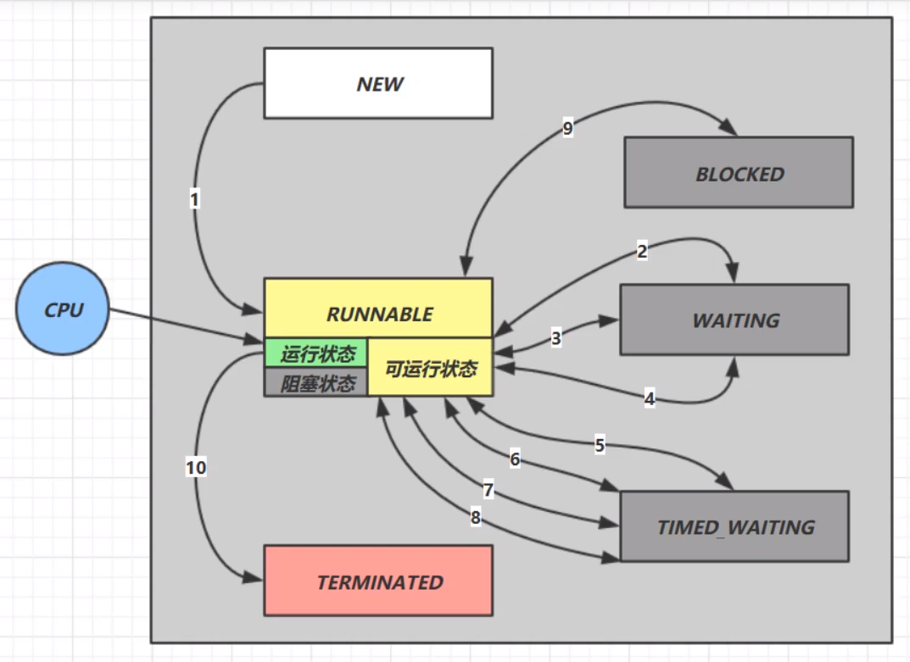
### NEW ---> RUNNABLE
当线程对象调用start()方法，可以交给CPU去调度线程的run()方法
### RUNNABLE ---> WAITING
t线程用synchronized(obj)获取对象锁后
#### 1)
- 调用obj.wait()方法时，t线程从 RUNNABLE ---> WAITING
- 调用obj.notify()，obj.notifyAll()，t.interrupt()时:
  - 竞争锁成功，t线程从WAITING ---> RUNNABLE
  - 竞争锁失败，t线程从WAITING ---> BLOCKED

#### 2)
- 当前线程调用t.join()方法时，当前线程从RUNNABLE ---> WAITING
  - 注意是，当前线程等待t线程监视器上等待
- t线程运行结束或，调用了当前线程的interrupt()方法，当前线程从WAITING ---> RUNNABLE

#### 3)
- 当前线程调用LockSupport.park()方法，让当前线程从 RUNNABLE ---> WAITING
- 调用LockSupport.unpark(目标线程)或调用了线程的interrupt()方法，目标线程从WAITING ---> RUNNABLE

### RUNNABLE ---> TIMED_WAITING
#### 1)
t线程用synchronized(obj)获取了对象锁后
- 调用obj.wait(long n)方法，t线程从RUNNABLE ---> TIMED_WAITING
- t线程等待的时间超过n毫秒，或调用obj.notify()，obj.notifyAll()，obj.interrupt()
  - 竞争锁成功，从TIMED_WAITING ---> RUNNABLE
  - 竞争锁失败，从TIMED_WAITING ---> BLOCKED

#### 2)
- 当前线程调用t.join(long n)方法时，当前线程从RUNNABLE ---> TIMED_WAITING
  - 注意时当前线程在t线程对象的监视器上等待
- 当前线程等待的时间超过了n毫秒后，或t线程运行结束后，或调用当前线程的interrupt()方法时，当前线程从 TIMED_WAITING ---> RUNNABLE

#### 3)
- 当前线程调用Thread.sleep(long n)，当前线程从 RUNNABLE ---> TIMED_WAITING
- 当前等待的时间超过了n毫秒后，当前线程从 TIMED_WAITING ---> RUNNABLE

#### 4)
- 当前线程调用LockSupport.parkNanos(long nanos)或LockSupport.parkUntil()方法，当前线程从 RUNNABLE --> TIMED_WAITING
- 调用LockSupport.unpark(目标线程)或调用了线程的interrupt()方法，或是等待的时间超时，会让目标线程从 TIMED_WAITING ---> RUNNABLE

### RUNNABLE ---> BLOCKED
#### 5)
- t线程用synchronized(obj)获取了对象锁时如果竞争失败
- 持obj锁线程的同步代码块执行完毕，会唤醒该对象上的所有BLOCKED线程重新竞争，如果其中t线程竞争成功，从BLOCKED ---> RUNNABLE ，其他竞争失败的线程仍然是，BLOCKED

### RUNNABLE ---> TERMINATED
当线程的所有代码执行完后，进入TERMINATED

## 4.11多把锁
### 多把不相干的锁
一件大房子有两个功能，睡觉，学习，互不打扰

现在小南要学习，小女要睡觉，但只有一间屋子（一个对象锁）的话，那么并发度很低

解决方法准备多个房间（多个对象锁）

例如
```java
@Slf4j
public class Test0 {
    public static void main(String[] args) {
        BigRoom bigRoom = new BigRoom();
        new Thread(() -> {
            synchronized(bigRoom) {
                log.debug("小女进入房间开始睡觉");
                Sleeper.sleepBySeconds(2);
            }
        }, "小女").start();

        new Thread(() -> {
            synchronized(bigRoom) {
                log.debug("小南进入房间开始学习");
                Sleeper.sleepBySeconds(1);
            }
        }, "小南").start();

    }

}

class BigRoom {
    
}
```
> 从运行结果看
> - 并发度不高，串行执行的
> - 但是两个人做的事情互不打扰的
> 
修改
```java
@Slf4j
public class Test0 {
    public static void main(String[] args) {
        BigRoom bigRoom = new BigRoom();
        new Thread(bigRoom::sleep, "小女").start();

        new Thread(bigRoom::study, "小南").start();
    }

}
@Slf4j
class BigRoom {
    private final Object studyRoom = new Object();
    private final Object badRoom = new Object();

    public void study() {
        synchronized(studyRoom) {
            log.debug("{} 进入房间开始学习", Thread.currentThread().getName());
            Sleeper.sleepBySeconds(1);
            log.debug("{} 学习完", Thread.currentThread().getName());
        }
    }

    public void sleep() {
        synchronized(badRoom) {
            log.debug("{} 进入房间开始睡觉", Thread.currentThread().getName());
            Sleeper.sleepBySeconds(2);
            log.debug("{} 睡醒", Thread.currentThread().getName());
        }
    }
}
```
> 将锁的粒度细分
> - 好处，可以增加并发度
> - 坏处，如果一个线程需要同时获取多把锁，就容易发生死锁

## 4.12活跃性
### 死锁
有这样的情况：一个线程需要同时获取多把锁，这时就容易发生死锁
t1线程获取A对象锁，接下来想获取B对象锁
t2线程获取B对象锁，接下来想获取A对象锁

### 定位死锁
- 在IDEA Terminal 使用jps定位进程id，再使用【jstack 进程id】定位
- windows命令行输入jconsole也可以

### 哲学家就餐问题
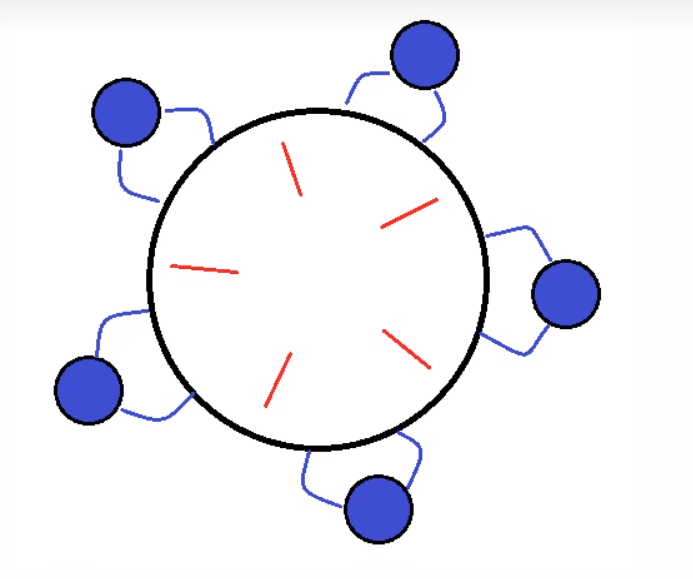
有五位哲学家，围坐圆桌旁
- 他们只有两件事，思考和吃饭，思考一会吃口饭，吃完后接着思考
  - 吃饭时要用两根筷子吃，桌上共有5根筷子，每位哲学家左右手各一根筷子
  - 如果筷子被身边人拿了，自己就要等待

代码演示
```java
@Slf4j
public class Test0 {
    public static void main(String[] args) {
        Chopstick c1 = new Chopstick("1");
        Chopstick c2 = new Chopstick("2");
        Chopstick c3 = new Chopstick("3");
        Chopstick c4 = new Chopstick("4");
        Chopstick c5 = new Chopstick("5");
        new Philosopher("苏格拉底", c1, c2).start();
        new Philosopher("柏拉图", c2, c3).start();
        new Philosopher("亚里士多德", c3, c4).start();
        new Philosopher("赫拉克利特", c4, c5).start();
        new Philosopher("阿基米德", c5, c1).start();
    }
}
class Chopstick {
    private String name;
    public Chopstick(String name) {
        this.name = name;
    }
    @Override
    public String toString() {
        return "Chopstick{" +
                "name='" + name + '\'' +
                '}';
    }
}
//哲学家类
@Slf4j
class Philosopher extends Thread {
    private Chopstick left;
    private Chopstick right;
    public Philosopher(String name, Chopstick left, Chopstick right) {
        super(name);
        this.left = left;
        this.right = right;
    }
    @Override
    public void run() {
        while (true) {
            //尝试获取左边的筷子
            synchronized (left) {
                //尝试获取右边的筷子
                synchronized (right) {
                    eat();
                }
            }
        }
    }

    private void eat() {
        log.debug("eating...");
        Sleeper.sleepBySeconds(1);
    }
}
```
运行结果就是发生了死锁

### 活锁
活锁出现在两个线程互相交换对方的结果条件，最后谁都无法结束，例如
```java
@Slf4j
public class Test1 {
    static volatile int count = 10;
    static final Object lock = new Object();
    public static void main(String[] args) {
        new Thread(() -> {
            //期望减到0就结束
            while (count > 0) {
                try {
                    Thread.sleep(200);
                } catch (InterruptedException e) {
                    throw new RuntimeException(e);
                }
                count--;
                log.debug("count: " + count);
            }
        }, "t1").start();
        new Thread(() -> {
            //期望加到20就结束
            while (count < 20) {
                try {
                    Thread.sleep(200);
                } catch (InterruptedException e) {
                    throw new RuntimeException(e);
                }
                count++;
                log.debug("count: " + count);
            }
        }, "t2").start();
    }
}
```
解决方法
- 让他们尽量交错运行，睡眠时间不同，
- 或者让他们的睡眠时间随机

### 饥饿
很多教程中把饥饿定义为，一个线程由于优先级太低，始终得不到CPU调度执行，也不能够结束
饥饿的情况不易演示，讲读写锁时会涉及饥饿问题

下面我讲一下我遇到的一个线程饥饿的例子，先来看看使用顺序加锁的方式解决之前的死锁问题
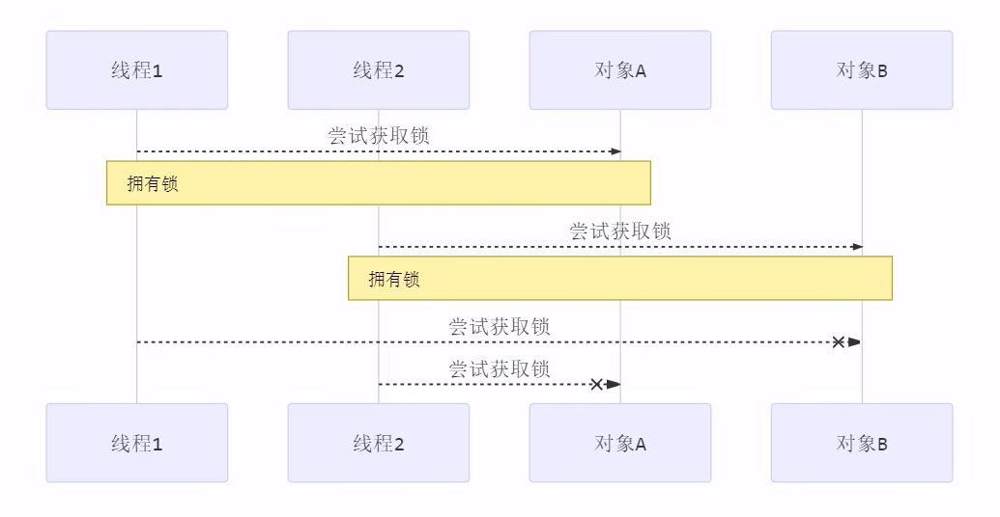
顺序加锁的解决方案
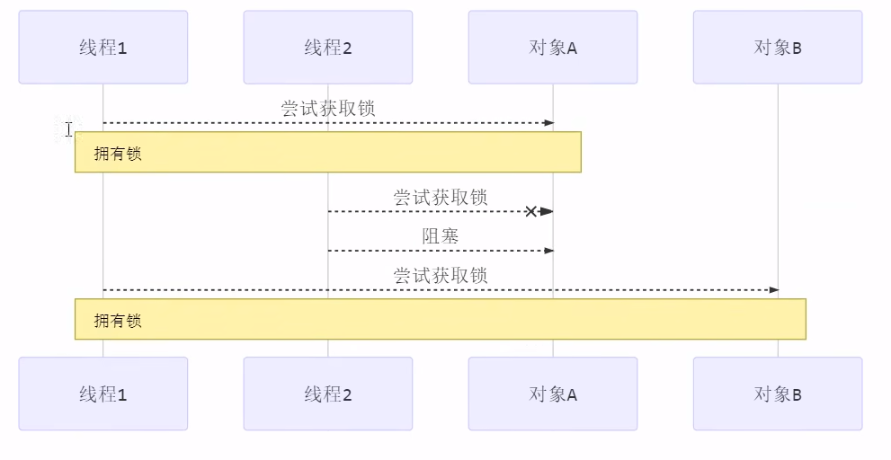
```java
@Slf4j
public class Test0 {
    public static void main(String[] args) {
        Chopstick c1 = new Chopstick("1");
        Chopstick c2 = new Chopstick("2");
        Chopstick c3 = new Chopstick("3");
        Chopstick c4 = new Chopstick("4");
        Chopstick c5 = new Chopstick("5");
        new Philosopher("苏格拉底", c1, c2).start();
        new Philosopher("柏拉图", c2, c3).start();
        new Philosopher("亚里士多德", c3, c4).start();
        new Philosopher("赫拉克利特", c4, c5).start();
        new Philosopher("阿基米德", c1, c5).start();
    }
}
class Chopstick {
    private String name;
    public Chopstick(String name) {
        this.name = name;
    }
    @Override
    public String toString() {
        return "Chopstick{" +
                "name='" + name + '\'' +
                '}';
    }
}
//哲学家类
@Slf4j
class Philosopher extends Thread {
    private Chopstick left;
    private Chopstick right;
    public Philosopher(String name, Chopstick left, Chopstick right) {
        super(name);
        this.left = left;
        this.right = right;
    }
    @Override
    public void run() {
        while (true) {
            //尝试获取左边的筷子
            synchronized (left) {
                //尝试获取右边的筷子
                synchronized (right) {
                    eat();
                }
            }
        }
    }

    private void eat() {
        log.debug("eating...");
        Sleeper.sleepBySeconds(1);
    }
}
```
> 原因(我的理解):
> 退锁有层级，阿基米德要eat就要等，c1，c1被苏格拉底拿着，他在等待c2才能释放c2，c1，其他人也是这样
>
> 赫拉克利特先退c5，c5几乎没有人争(阿基米德还没有拿到c1)，然后退c4，这个时间可能又该他执行了，偶尔亚里士多德能拿到c4
> 

## 4.13 ReentrantLock
相对于synchronized它具备如下特点
- 可中断
- 可以设置超时间
- 可以设置公平锁
- 可以支持多个条件变量

与synchronized一样支持重入

基本语法
```text
//获取锁
reentrantLock.lock();
try {
    //临界区
}final {
    //释放锁
    reentrantLock.unlock();
}
```
### 可重入
可重入是指同一个线程如果首次获的这把锁，那么因为他是
这把锁的owner(拥有者)，因此有权利再次获取这把锁，如
果是不可重入，即使是同一个线程第二次获得这把锁，自己
也会被锁挡住

### 可打断
```java
@Slf4j
public class Test1 {
    private static final ReentrantLock lock = new ReentrantLock();
    public static void main(String[] args) {
        Thread t1 = new Thread(() -> {
            try {
                log.debug("等待获取锁");
                lock.lockInterruptibly();
            }catch (Exception e) {
                //没有获取到锁结束等待
                log.debug("没有获取到锁结束等待");
                return;
            }
            try {
                log.debug("获取到锁");
            }finally {
                lock.unlock();
            }
        }, "t1");
        lock.lock();
        t1.start();
        Sleeper.sleepBySeconds(1);
        log.debug("打断t1");
        t1.interrupt();
    }
}
```
注意:
- 使用lock是不可打断的

### 锁超时
立即返回
```java
@Slf4j
public class Test2 {
    private static final ReentrantLock lock = new ReentrantLock();
    public static void main(String[] args) {
        Thread t1 = new Thread(() -> {
            //尝试获取锁
            log.debug("尝试获取锁");
            if (!lock.tryLock()) {
                log.debug("没有获取到锁，返回");
                return;
            }
            try {
                log.debug("获取到锁");
            }finally {
                lock.unlock();
            }
        }, "t1");
        lock.lock();
        log.debug("主线程获取到锁");
        t1.start();
    }
}
```
超时返回
```java
@Slf4j
public class Test2 {
    private static final ReentrantLock lock = new ReentrantLock();
    public static void main(String[] args) {
        Thread t1 = new Thread(() -> {
            //尝试获取锁
            try {
                log.debug("尝试获取锁，最多等待2s");
                //因为tryLock可以被打断所以需要再try catch块中
                if (!lock.tryLock(2, TimeUnit.SECONDS)) {
                    log.debug("超时没有获取到锁，返回");
                    return;
                }
            } catch (InterruptedException e) {
                throw new RuntimeException(e);
            }
            try {
                log.debug("获取到锁");
            }finally {
                lock.unlock();
            }
        }, "t1");
        lock.lock();
        log.debug("主线程获取到锁");
        t1.start();
    }
}
```
修改银行家吃饭
```java
@Slf4j
public class Test3 {
    public static void main(String[] args) {
        Chopstick c1 = new Chopstick("1");
        Chopstick c2 = new Chopstick("2");
        Chopstick c3 = new Chopstick("3");
        Chopstick c4 = new Chopstick("4");
        Chopstick c5 = new Chopstick("5");
        new Philosopher("苏格拉底", c1, c2).start();
        new Philosopher("柏拉图", c2, c3).start();
        new Philosopher("亚里士多德", c3, c4).start();
        new Philosopher("赫拉克利特", c4, c5).start();
        new Philosopher("阿基米德", c5, c1).start();
    }
}
class Chopstick extends ReentrantLock{
    private String name;
    public Chopstick(String name) {
        this.name = name;
    }
    @Override
    public String toString() {
        return "Chopstick{" +
                "name='" + name + '\'' +
                '}';
    }
}
//哲学家类
@Slf4j
class Philosopher extends Thread {
    private final Chopstick left;
    private final Chopstick right;
    public Philosopher(String name, Chopstick left, Chopstick right) {
        super(name);
        this.left = left;
        this.right = right;
    }

    @Override
    public void run() {
        while (true) {
            //尝试获取左筷子
            if (left.tryLock()) {
                try {
                    log.debug("{} 拿到左筷子", Thread.currentThread().getName());
                    //尝试获取右筷子
                    if (right.tryLock()) {
                        try {
                            log.debug("{} 拿到右筷子", Thread.currentThread().getName());
                            eat();
                        }finally {
                            right.unlock();
                            log.debug("{} 释放右筷子", Thread.currentThread().getName());
                        }
                    }
                }finally {
                    left.unlock();
                    log.debug("{} 释放左筷子", Thread.currentThread().getName());
                }
            }
            Sleeper.sleepByMillisecond(1000);
        }
    }

    private void eat() {
        log.debug("eating...");
        Sleeper.sleepBySeconds(1);
    }
}
```

### 公平锁
ReentrantLock默认是不公平的

### 条件变量
synchronized中也有条件变量，就是之前原理中提到的WaitSet休息室，当条件不满足时进入WaitSet休息室，等待

ReentrantLock的条件变量比synchronized强大之处在于，它是支持多个条件变量，这就好比
- synchronized是那些不满足条件的的线程都在一个休息室，而且唤醒是全唤醒，很多有不满足条件
- ReentrantLock支持多间，唤醒也是按休息室唤醒的

使用流程
- await前需要获得锁
- await执行后，会释放锁，进入conditionObject等待
- await的线程被唤醒（或打断，超时）去重新竞争lock锁
- 竞争lock锁成功后，从await后继续执行

```java
@Slf4j
public class Test4 {
    private static final ReentrantLock room = new ReentrantLock();
    private static final Condition waitCigaretteSet = room.newCondition();
    private static final Condition waitTakeoutSet = room.newCondition();
    private static boolean hasCigarette =false;
    private static boolean hasTakeout =false;


    public static void main(String[] args) {
        new Thread(() -> {
            //获取锁
            room.lock();
            try {
                while (!hasCigarette) {
                    log.debug("没有外卖，休息一会");
                    //取等烟休息室等待
                    waitCigaretteSet.await();
                }
                log.debug("开始干活");
            } catch (InterruptedException e) {
                log.debug("被打断");
                e.printStackTrace();
            } finally {
                room.unlock();
            }
        }, "小南").start();
        new Thread(() -> {
            room.lock();
            try {
                while (!hasTakeout) {
                    log.debug("没有外卖，休息一会");
                    //去等外卖休息室等待
                    waitTakeoutSet.await();
                }
                log.debug("开始干活");
            } catch (InterruptedException e) {
                log.debug("被打断");
                e.printStackTrace();
            } finally {
                room.unlock();
            }
        }, "小女").start();


        Sleeper.sleepBySeconds(1);
        new Thread(() -> {
            room.lock();
            try {
                log.debug("烟送到");
                hasCigarette = true;
                waitCigaretteSet.signalAll();
            }finally {
                room.unlock();
            }
        }, "送烟的").start();
        Sleeper.sleepBySeconds(1);
        new Thread(() -> {
            room.lock();
            try {
                log.debug("外卖送到");
                hasTakeout = true;
                waitTakeoutSet.signalAll();
            }finally {
                room.unlock();
            }
        }, "送外卖的").start();

    }
}
```

### 同步模式之顺序控制
固定运行顺序

一个线程打印1，一个线程打印2，必须先打印2再打印1
- wait-notify实现 pro2-model-p2-Test0
- ReentrantLock&Condition实现 pro2-model-p2-Test1
- LockSupport.park&unpark实现 pro2-model-p2-Test1

交替输出

线程1输出a 5次，线程2输出b 5次，线程3输出c 5次，要求abc循环输出
### wait-notify


